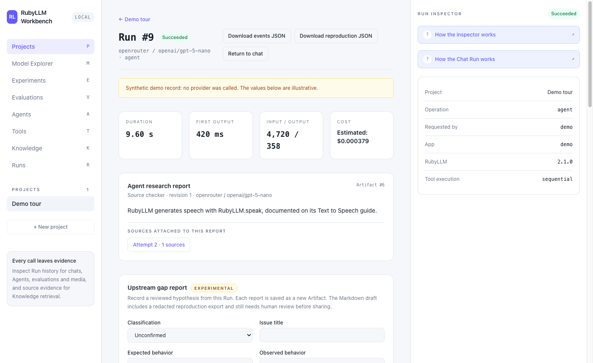
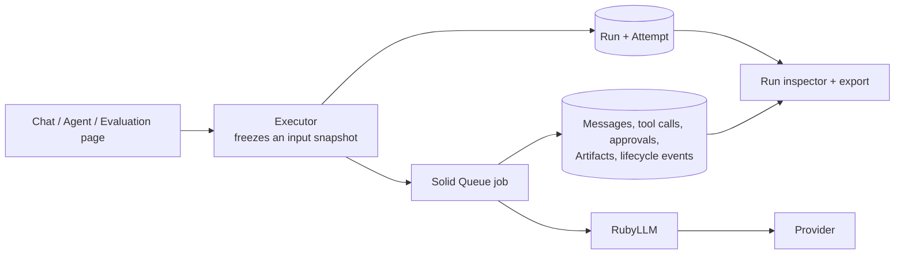

# RubyLLM Workbench

[](https://github.com/yorzi/rubyllm-workbench/actions/workflows/ci.yml)
[](LICENSE)

A local-first Rails reference application for building and inspecting AI
workflows with [RubyLLM](https://rubyllm.com). It shows how provider calls
become durable, inspectable Rails state: chats, structured executions, Agents,
media requests and evaluation cases keep Runs with Attempts, usage, cost,
approvals, Artifacts and lifecycle timelines. Knowledge ingestion, embeddings
and retrieval keep source/chunk evidence in their own workspace.

It complements RubyLLM's guides with a working application. It is a
single-user developer workbench, not a hosted product: there are no accounts,
teams, billing or tenant isolation.

This is an independent project and is not affiliated with the RubyLLM
maintainers.

## What you can do

- **Chat** with any configured model, with streaming and optional provider web
  search with citations.
- **Compare structured output** across models with a JSON Schema.
- **Use tools with approval**: code-registered tools, human approve/deny, and
  a safe opt-in parallel-call policy.
- **Run saved Agents** that advance step by step under a durable, crash-safe
  execution lease and finish with a cited report.
- **Search your own Knowledge**: text and file sources, provider embeddings,
  lexical/semantic/hybrid retrieval with visible evidence, optional rerank.
- **Evaluate models** on revisioned datasets: per-case Runs, outcome metrics,
  human reviews and an optional rubric judge.
- **Generate media** (experimental): speech, images, video and transcription.
- **Export a Run** as redacted reproduction or event JSON.

Each feature's admission rules and evidence, local and live, are in the
[capability matrix](docs/CAPABILITIES.md). The historical RubyLLM 2.0 live run passed chat,
structured output, tools, an Agent with web search, embeddings, an evaluation,
speech, transcription and image generation against OpenRouter. The current
RubyLLM 2.1 upgrade has separate local evidence; live revalidation is pending.

## Explore the engineering

Start with the [ten-minute showcase route](docs/SHOWCASE.md). It connects each
demo to the Rails and RubyLLM code and the tests that explain its boundaries:
streaming persistence, revisioned inputs, approvals, transactional delivery,
lease fencing, retrieval provenance and honest evaluation outcomes. Agent,
evaluation and Knowledge pages include source-linked explanations and small
execution maps.



The screenshot uses synthetic tour records on RubyLLM 2.1.0 (2026-10-08);
its latency, usage and cost values are illustrative.

The [development plan](ROADMAP.md) prioritizes a safe public read-only demo,
then a measured Knowledge → Agent → Evaluation case study and native RubyLLM
2.1 MCP, Judge/Evaluation and OpenTelemetry examples. Those native integrations
are planned; installing the new framework schema does not implement them.

## Quickstart

Requires Ruby 4.0.2 and Node.js 24.21.0 (`.ruby-version`, `.nvmrc`). Uses
Rails 8.1.4 and RubyLLM 2.1.0.

```sh
nvm install && nvm use
bin/setup --skip-server       # installs gems and npm packages, prepares SQLite
bin/rails workbench:demo      # optional: synthetic demo data, no API keys needed
bin/dev                       # http://127.0.0.1:3000
```

To call real models, copy `.env.example` to `.env` and fill a provider key
locally. `bin/dev` loads it through Foreman. Standalone `bin/rails` commands
read the process environment or encrypted Rails credentials; they do not load
`.env` automatically. Never put a key in a command-line argument.

```sh
cp .env.example .env         # edit the file locally, then start bin/dev
```

The Model Explorer works without keys and shows which providers are
configured. Active Storage image variants need the optional `libvips` library
(`brew install vips` or `apt-get install libvips`). More in
[operations](docs/OPERATIONS.md).

## How a call becomes evidence



The patterns worth copying live in the Rails layer: snapshotting inputs so old
Runs never change, adding Attempts instead of overwriting failures, durable
approvals, a transactional outbox with lease fencing for Agents, and recovery
that never silently replays provider work. See
[architecture](docs/ARCHITECTURE.md).

## Documentation

- [System guide](docs/SYSTEM_GUIDE.md): concepts, flows and what to trust
- [Showcase guide](docs/SHOWCASE.md): tour, skills, code and verification
- [Capability matrix](docs/CAPABILITIES.md): admission rules and evidence
- [Architecture](docs/ARCHITECTURE.md): diagrams of records, jobs and states
- [Operations](docs/OPERATIONS.md): setup, verification, live dogfood,
  troubleshooting
- [Implementation map](IMPLEMENTATION_MAP.md): where the code lives
- [Roadmap](ROADMAP.md) and [changelog](docs/CHANGELOG.md)
- [Release checklist](docs/RELEASING.md) and [upgrade review](docs/UPGRADE_REVIEW_2026-10-08.md)
- [Documentation index](docs/README.md)

## Development

```sh
bin/rails test              # unit, integration and request tests
CI=1 bin/rails test:system  # Selenium browser tests with built assets
bin/rubocop && bin/brakeman --no-pager
bin/dogfood                 # opt-in live provider scenarios (needs a key)
```

CI runs tests, system tests, lint, security scans, a production asset build
and a Docker build on every push. Provider calls in tests are always faked;
live checks are opt-in. Build the Vite test assets once with
`bin/vite build --mode=test` before parallel tests, as CI does.

## Contributing and security

Contributions are welcome; read [CONTRIBUTING.md](CONTRIBUTING.md) first.
Report vulnerabilities privately as described in [SECURITY.md](SECURITY.md).

## License

Released under the [MIT License](LICENSE).
