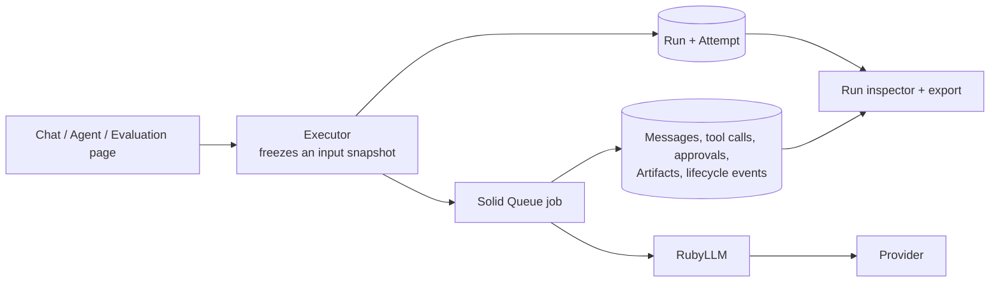

# RubyLLM Workbench

A local-first Rails reference application for building and inspecting AI
workflows with [RubyLLM](https://rubyllm.com). It shows how provider calls
become durable, inspectable records: every chat, structured output, tool call,
Agent step, embedding, media generation and evaluation leaves a Run you can
open later, with its Attempts, usage, cost, approvals, Artifacts and a
lifecycle timeline.

It complements RubyLLM's guides with a working application. It is a
single-user developer workbench, not a hosted product: there are no accounts,
teams, billing or tenant isolation.

## What you can do

- **Chat** with any configured model, with streaming and optional provider web
  search with citations.
- **Compare structured output** across models with a JSON Schema.
- **Use tools with approval**: code-registered tools, human approve/deny, and
  a safe opt-in parallel-call policy.
- **Run saved Agents** that advance step by step under a durable, crash-safe
  execution lease and finish with a cited report.
- **Search your own Knowledge**: text and file sources, provider embeddings,
  lexical/semantic/hybrid retrieval with visible evidence, optional rerank.
- **Evaluate models** on revisioned datasets: per-case Runs, outcome metrics,
  human reviews and an optional rubric judge.
- **Generate media** (experimental): speech, images, video and transcription.
- **Export a Run** as redacted reproduction or event JSON.

Each feature's admission rules and evidence, local and live, are in the
[capability matrix](docs/CAPABILITIES.md). The latest live run passed chat,
structured output, tools, an Agent with web search, embeddings, an evaluation,
speech, transcription and image generation against OpenRouter.

## Quickstart

Requires Ruby 4.0.2 and Node.js 24.21.0 (`.ruby-version`, `.nvmrc`).

```sh
nvm install && nvm use
bin/setup --skip-server       # installs gems and npm packages, prepares SQLite
bin/rails workbench:demo      # optional: synthetic demo data, no API keys needed
bin/dev                       # http://127.0.0.1:3000
```

To call real models, configure a provider through RubyLLM, for example in your
shell or a local `.env`:

```sh
OPENROUTER_API_KEY=...        # or OPENAI_API_KEY, ANTHROPIC_API_KEY, GEMINI_API_KEY, ...
```

The Model Explorer works without keys and shows which providers are
configured. Active Storage image variants need the optional `libvips` library
(`brew install vips` or `apt-get install libvips`). More in
[operations](docs/OPERATIONS.md).

## How a call becomes evidence



The patterns worth copying live in the Rails layer: snapshotting inputs so old
Runs never change, adding Attempts instead of overwriting failures, durable
approvals, a transactional outbox with lease fencing for Agents, and recovery
that never silently replays provider work. See
[architecture](docs/ARCHITECTURE.md).

## Documentation

- [System guide](docs/SYSTEM_GUIDE.md): concepts, flows and what to trust
- [Capability matrix](docs/CAPABILITIES.md): admission rules and evidence
- [Architecture](docs/ARCHITECTURE.md): diagrams of records, jobs and states
- [Operations](docs/OPERATIONS.md): setup, verification, live dogfood,
  troubleshooting
- [Implementation map](IMPLEMENTATION_MAP.md): where the code lives
- [Roadmap](ROADMAP.md) and [changelog](docs/CHANGELOG.md)
- [Documentation index](docs/README.md)

## Development

```sh
bin/rails test              # unit, integration and request tests
bin/rails test:system       # Selenium browser tests
bin/rubocop && bin/brakeman --no-pager
bin/dogfood                 # opt-in live provider scenarios (needs a key)
```

CI runs tests, system tests, lint, security scans, a production asset build
and a Docker build on every push. Provider calls in tests are always faked;
live checks are opt-in.

## Contributing and security

Contributions are welcome; read [CONTRIBUTING.md](CONTRIBUTING.md) first.
Report vulnerabilities privately as described in [SECURITY.md](SECURITY.md).

## License

Released under the [MIT License](LICENSE).
