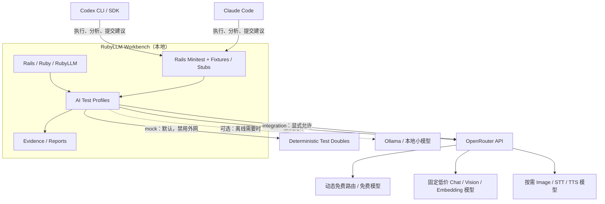

# RubyLLM Workbench — AI 使用与测试指导方案

> **版本**：v1.1
>
> **更新**：2026-10-09
>
> **状态**：配置与测试入口已落地；未完成任务保留复选框，能力证据以 `docs/CAPABILITIES.md` 为准
>
> **适用**：RubyLLM Workbench、Ruby/Rails AI 应用开发、RubyLLM 开源贡献与 Provider 兼容性验证
>
> **开发设备**：Apple M5 MacBook Pro，24 GB 统一内存
>
> **核心选型**：**RubyLLM + OpenRouter + Rails Minitest + Stubs / WebMock + Codex / Claude Code**；Ollama 按需启用，不作为默认依赖

---

## 0. 执行摘要（先读这一节）

Workbench 的目标是**用尽可能低的成本跑通 AI 功能，快速发现 RubyLLM 的集成问题**，而不是部署或运营自己的推理集群。

**正式决策：**

1. **OpenRouter 是默认真实模型入口**：具体的免费模型用于显式开启的流程验收；固定 Model ID 同样适用于集成测试。付费模型仅在单独授权后使用，不要求为验收付费。
2. **Rails Minitest + Stubs / WebMock 是默认自动化测试入口**：普通 `bin/rails test` 不得发起任何外部 AI API 请求。
3. **Codex / Claude Code 是开发和测试执行者，不是通用推理 Provider**：负责编码、复现、跑测试、排查、总结与提出 PR；不依赖第三方工具转发订阅 OAuth 凭证。
4. **暂不安装和维护 Ollama / LocalAI / LiteLLM**：只有当离线、隐私、吞吐量或某个原生 Provider 兼容性问题有明确需求时再启用。
5. **不为每种能力自建本地服务**：文本、工具、视觉、Embedding 优先验证 OpenRouter；图片、语音、视频使用 Mock + 少量真实 API 探针。
6. **测试默认 fail-closed**：未明确允许的网络调用、未知收费模型、隐式 Fallback 和未授权的工具执行都应失败，而不是静默放行。
7. **测试结论有边界**：通过 OpenRouter 的测试，只能证明 RubyLLM → OpenRouter → 选定上游这一条路径，不等于原生 OpenAI / Anthropic / Gemini Provider 均已通过。

### 不做什么

- 不为了“全功能”部署几十 GB 的模型。
- 不额外维护无必要的 API Gateway、Docker Compose 集群或模型管理 UI。
- 不把 `openrouter/free` 用于确定性的输出文本断言。
- 不把 ChatGPT / Codex / Claude Code 订阅登录态包装成未经明确授权的通用付费 API。
- 不让 AI Agent 在没有人工批准的情况下进行付费压力测试、发布、密钥修改或生产数据操作。

### 建议的仓库落点

本文件的规范路径为 `docs/AI_USAGE_GUIDE.md`。`AGENTS.md` 和 `CLAUDE.md` 引用它。

**针对仓库的修正（2026-10-09）：** 现有测试框架是 Rails Minitest，复用 `test/` 与 `bin/dogfood`，不引入第二套 RSpec。密钥使用环境注入或本地 Rails credentials；不在命令行内联设置。默认 HTTP 隔离在 `test/support/ai_network_policy.rb`，真实模型/价格检查在 `test/support/live_acceptance_policy.rb`。示例中的单独 API 调用仍只是用法说明，不能替代这些守卫。

---

## 1. 目标、范围与验收标准

### 1.1 主要目标

- 覆盖 RubyLLM 的 Chat、Streaming、Tool Calling、Structured Output、Vision、Embeddings。
- 为 Image Generation、Speech-to-Text（STT）、Text-to-Speech（TTS）、OCR、Reranking 等提供可扩展的测试入口。
- 能区分 `RubyLLM`、OpenRouter 协议适配、选定上游模型、Workbench 业务代码各自的错误。
- 保持离线单元测试高速、稳定、可在 CI 运行。
- 真实模型测试可手动触发、有预算限制、保留复现信息。
- 使 Codex/Claude Code 能遵循一致的 `verify → reproduce → isolate → fix → test → report` 流程。

### 1.2 非目标

- 提供生产级 LLM Hosting、模型训练或微调。
- 测算本地推理极限性能。
- 以输出质量评分作为日常 CI 的强制门槛。
- 保证 OpenRouter 的某一免费模型永久可用。
- 复制完整 ChatGPT/Codex/Claude Code 商业订阅服务到自建 HTTP API。

### 1.3 完成标准（DoD）

- [x] 默认套件不要求 API Key，默认 WebMock 阻止外部 Ruby HTTP；loopback 服务例外。
- [x] 已配置 Key 且获授权后，可用一条 `bin/dogfood --include test_chat_streaming` 发起免费 Chat 验收。
- [ ] Streaming、Tools、JSON Schema、Vision、Embedding 各有一个最小用例。
- [x] 图片、音频能力的证据按 `CAPABILITIES.md` 区分；免费 TTS 与本地 TTS 分开。
- [ ] 所有真实请求均可看到所选 Provider、Model ID、运行 Profile、结果和成本（若 API 提供）。
- [ ] 失败时不会自动切换到其他 Provider 并把失败隐藏。
- [ ] API Key 有独立的月度额度限制，且不进入 Git、测试快照或日志。
- [x] 真实集成测试必须显式 opt-in，默认 live 文件全部跳过。

---

## 2. 总体架构



**重要边界：** Codex 和 Claude Code 管理开发流程；RubyLLM 管理应用内模型调用；OpenRouter 管理远端模型聚合。不要把这三个概念合并成一个 Provider。

### 2.1 为什么暂时不需要 All-in-One

| 组件 | 当前决定 | 触发引入的条件 |
|---|---|---|
| RubyLLM | **采用** | Workbench 的核心调用层 |
| OpenRouter | **采用** | 真实模型统一入口 |
| Rails Minitest + Stubs / WebMock | **采用** | 默认 CI 和确定性行为测试 |
| Codex / Claude Code | **采用** | AI 编码、测试编排、问题分析 |
| Ollama | 可选 | 离线、敏感数据、本地 Provider Issue、大量推理测试 |
| LocalAI | 暂缓 | 明确需要离线 Image / STT / TTS 时 |
| LiteLLM Proxy | 暂缓 | 多项目、多团队跨语言共享路由、统一鉴权/审计时 |
| CLIProxyAPI 一类 CLI→API 转换 | 不作为依赖 | 仅独立研究兼容性，严格遵守各服务授权条款 |

---

## 3. Provider 与测试 Profile 策略

### 3.1 四种 Profile

| Profile | 发出真实 AI 请求 | Provider | 适用场景 | 是否允许 Fallback |
|---|---:|---|---|---:|
| `mock` | **否** | Stub / Fixture / WebMock | 默认 `bin/rails test`、CI | 否 |
| `free` | 是（手动开启） | OpenRouter 免费模型 | 人工连通性、基本流程 Smoke Test | 否 |
| `integration` | 是（手动开启且另有付费授权） | OpenRouter **固定**模型 | 需要付费的兼容性验收；免费固定模型仍用 `free` | 否 |
| `local`（保留，尚未实现） | 尚未启用 | 用户提供的本地服务 / Ollama | 先实现适配器与独立测试入口 | 否 |

`hybrid`（本地失败转云端）**不属于测试 Profile**；未来业务演示可以另设，但必须在报告中记录实际 Provider，且不得用于兼容性验证。

### 3.2 模型选择规则

不要把某个“今天最便宜”的模型硬编码成长期工程规则。价格、免费路由、能力、速率限制都会变化。

| 能力 | 开发起点 | 稳定性策略 | 验证重点 |
|---|---|---|---|
| Chat / Streaming | 显式 `:free` 模型 ID | 精确模型 ID + 必要时固定上游 | 返回对象、分块、finish reason |
| Tool Calling | 支持 `tools` 的免费模型 | 固定支持 Tools 的模型（优先免费） | Tool arguments、执行循环 |
| Structured Output | 支持 `json_schema` 的模型 | 固定模型；严格校验 Schema | `response.parsed` 和字段类型 |
| Vision | 具备 `image` 输入能力的模型 | 固定图像输入模型 | 图片提交、结果解析 |
| Embeddings | 具体的兼容免费 Embedding 模型（可用时） | **固定模型 + 维度** | 数组长度、批量、向量索引 |
| Image | 输出 image 的模型 | 每次按需选择并核价 | 请求协议、响应格式、保存 |
| STT | 具备转录能力的模型 | 每次按需选择并核价 | 上传、文本、音频格式 |
| TTS | 具备生成音频能力的模型 | 每次按需选择并核价 | 音频 MIME/容器/保存 |
| Video | Mock 默认 | 仅项目明确要求时试真实服务 | 异步状态、超时、结果下载 |

**初始推荐：**

- 默认免费验收使用 `DOGFOOD_CHAT_MODEL` 等具体 `:free` ID；运行前检查当前目录价格全零。`openrouter/free` 是可选人工路由实验，现有 fail-closed harness 不接受该动态 ID，也不把它用于确定性断言。
- `AI_INTEGRATION_MODEL` —— 必须在正式运行前，从 OpenRouter 列表中选择一个**具体且支持本次能力的模型 ID**（优先免费）。
- `AI_EMBEDDING_MODEL` —— 从 OpenRouter Embeddings Models API 选择确实可用的模型，固定 ID、维度和索引版本。
- 不为 Image、STT、TTS 设未经验证的“万能默认模型”。

模型选型时至少记录：`model_id`、所需能力、输入/输出模态、支持参数、当前价格、上下文长度、测试日期；有必要时记录 `upstream_provider`。

### 3.3 模型发现与快照

相关地址：

- 模型目录：<https://openrouter.ai/models>
- OpenRouter 模型 API：<https://openrouter.ai/api/v1/models>
- Embedding 模型 API：<https://openrouter.ai/api/v1/embeddings/models>
- RubyLLM Model Registry：<https://rubyllm.com/models/>

可使用 `RubyLLM.models.refresh` 更新 RubyLLM 已知模型目录。但**目录刷新不是测试所需的每次步骤**；建议在人工选型、首次安装或模型出现变更时执行。避免在每次测试开始时调用远端模型注册表。

`assume_model_exists: true` 只用于**已确认真实存在但尚未被 RubyLLM Registry 收录**的模型；它会绕开部分能力校验，不应被用来隐藏错误模型 ID。

---

## 4. 首次设置（最小依赖）

### 4.1 先准备 OpenRouter

1. 在 <https://openrouter.ai/> 创建独立的 **Workbench API Key**。
2. 将该 Key 的限额设置为合理数值；初始建议使用**每月不超过约 USD 5 的测试预算**，并根据实际调用调整。
3. 若账户支持，启用模型 allowlist / guardrail，阻止意外调用昂贵模型。
4. 在 Dashboard 检查免费模型额度、当前速率限制、隐私/数据保留设置。
5. 切勿将 Key 提交到 Git、写入 Fixture、打印到日志或发送给 Coding Agent 的公开报告。

不要把密钥值放进命令行、内联 `export` 或子进程参数。可用系统密钥管理注入环境，或本地 Rails credentials 的 `openrouter_api_key`。

`cp .env.example .env` 后在本地编辑：`bin/dev` 的 Foreman 会加载 `.env`。`bin/rails`、`bin/dogfood` 与诊断脚本**不会自动加载** `.env` 或 `.env.local`；必须使用已安全准备的环境或 Rails credentials。仓库忽略这些环境文件及安装本地的加密 credentials。不要打印解密后的配置。

独立 Key 和月度限额须由所有者在 OpenRouter Dashboard 核对并配置；本次改动不证明账户额度已设置。

### 4.2 Ruby 依赖

对于**新建**项目，安装当前文档对应的 RubyLLM 稳定版；对于已存在的 Workbench，优先遵循仓库锁定的 Gemfile.lock，不要在添加指导文档时擅自升级 RubyLLM。

```bash
# 新项目参考，版本变更前先核对官方稳定版
bundle add ruby_llm --version 2.1.0

# 如尚未安装测试依赖
bundle add webmock --group test # 当前仓库已锁定；Rails 提供 Minitest
```

> 以上是安装参考命令，并不代表这些 Gem 尚未存在于你的 Workbench 仓库。

### 4.3 已实现的环境变量与保留约定

`.env.example` 不含真实 Key。当前可执行配置为：

```dotenv
OPENROUTER_API_KEY=
AI_TEST_PROFILE=mock
RUN_LIVE_AI=0
# 由 bin/dogfood 在独立串行子进程设置：
# LIVE_DOGFOOD=1
# LIVE_DOGFOOD_PAID=1  # 仅另有付费授权时
# DOGFOOD_CHAT_MODEL=具体的免费模型ID
# DOGFOOD_STRUCTURED_MODEL=具体的免费模型ID
# DOGFOOD_TOOLS_MODEL=具体的免费模型ID
# DOGFOOD_EMBEDDING_MODEL=具体的免费模型ID
# DOGFOOD_RERANK_MODEL=具体的免费模型ID
# DOGFOOD_SPEECH_MODEL=fish-audio/s2.1-pro-free:free
# DOGFOOD_SPEECH_VOICE=供应商明确支持的voice，可省略时才留空
```

`AI_TEST_PROFILE` 与 `RUN_LIVE_AI` 是 Workbench 测试约定，不是 RubyLLM 原生配置。默认进程阻止外部 Ruby HTTP；仅显式 live harness 开放 `https://openrouter.ai:443`。`bin/dogfood` 自行设置 free profile 和开启标志；设置标志不代替用户授权。

原方案的 `AI_FREE_MODEL`、`AI_INTEGRATION_MODEL`、`AI_EMBEDDING_MODEL`、`AI_VISION_MODEL`、`AI_IMAGE_MODEL`、`AI_STT_MODEL`、`AI_TTS_MODEL`、`AI_LOCAL_MODEL`、`AI_MAX_OUTPUT_TOKENS`、`AI_MAX_TOOL_TURNS`、`AI_TEST_BUDGET_USD` 是**保留建议，不是现有自动生效变量**。下面能力示例使用它们来表示必须显式选择的模型。真实验收请用已实现的 `DOGFOOD_*` 变量与命令。

当前免费 harness 固定零重试、60 秒超时、每进程最多 24 POST；聊天输出上限 2,048 token。TTS 有独立短文本限制，不使用聊天 token 上限。测试预算不影响交互式应用，也不是 OpenRouter 账单或月度硬上限。

### 4.4 RubyLLM 配置（Rails）

复用 `config/initializers/ruby_llm.rb`：从环境变量读取 Provider 配置，未提供时回退本地 Rails credentials。只读演示模式清除 Provider 配置。不要用示例覆盖现有 initializer，也不要在测试里隐式修改应用的默认云端模型。

真实测试始终显式指定 `model:`、`provider:`；`test/test_helper.rb` 从 bundled JSON 加载 Registry，不刷新远端目录，并设 `max_retries = 0`。`LiveAcceptancePolicy` 再施加能力、价格与请求预算限制。

对于无 Rails 的独立 Ruby 复现，用 `RubyLLM.context` 隔离配置，并自行实施授权、价格、超时与日志脱敏；不要依赖 Gem 默认模型。

### 4.5 第一个真实 API Smoke Test

先运行离线测试，再使用仓库的真实入口（本命令会调用 API）：

```bash
PARALLEL_WORKERS=1 bin/rails test
# 在已获免费测试授权、配置好 Key 后：
bin/dogfood --include test_chat_streaming
# 免费 TTS 的 RubyLLM → Speech Run → Active Storage 链路：
bin/dogfood --include test_openrouter_free_speech
# 独立原始 REST 探针（1 POST，不作为应用替代实现）：
RUN_LIVE_AI=1 AI_TEST_PROFILE=free RAILS_ENV=test \
  bundle exec ruby script/diagnostics/openrouter_free_tts.rb
```

`bin/dogfood` 自动设置 `RUN_LIVE_AI=1 AI_TEST_PROFILE=free LIVE_DOGFOOD=1`，并串行执行指定用例。免费模式拒绝未知价格、非 `:free` ID 和未检查模型。每次模型/能力变化先核价；目录失败不得继续猜测价格。

如果失败，首先检查 API Key、额度、模型可用性/能力、协议、网络错误。不要自动切换付费模型或打开 Fallback。TTS 模型和 voice 可用性与证据边界见 [CAPABILITIES.md](CAPABILITIES.md)；本地 TTS 等所有者提供 API 后另行接入。

---

## 5. RubyLLM 常用能力：最小集成案例

> 以下 Ruby 代码是 **API 使用范例**，并不自动实现网络授权策略。运行真实请求前须显式设置 `RUN_LIVE_AI=1`。选择不支持某能力的模型时，请求失败属于预期的兼容性信号。

### 5.1 Chat

```ruby
response = RubyLLM.chat(
  model: ENV.fetch("AI_INTEGRATION_MODEL"),
  provider: :openrouter
).ask("Answer with one sentence: what is Ruby?")

puts response.content
puts response.model
```

断言重点：非空响应、Message 属性、模型 ID、usage/cost（存在时）。**不要严格匹配整段自然语言文本。**

### 5.2 Streaming

```ruby
parts = []

response = RubyLLM.chat(
  model: ENV.fetch("AI_INTEGRATION_MODEL"),
  provider: :openrouter
).ask("Write one short sentence about Rails.") do |chunk|
  parts << chunk.content if chunk.content
end

raise "empty stream" if parts.join.empty?
puts response.content
```

断言重点：最终响应不为空、按顺序消费 chunk、结束事件、非文本 chunk 不导致异常。不要假设每个 chunk 都有 token 计数。

### 5.3 Structured Output

```ruby
class WorkbenchStatusSchema < Schematist::Schema
  string :status
  integer :count
end

response = RubyLLM.chat(
  model: ENV.fetch("AI_INTEGRATION_MODEL"),
  provider: :openrouter
).with_schema(WorkbenchStatusSchema).ask(
  'Return status "ok" and count 2.'
)

raise "not a hash" unless response.parsed.is_a?(Hash)
raise "invalid count" unless response.parsed["count"].is_a?(Integer)
```

断言重点：**JSON Schema 兼容性与字段类型**。某模型不支持严格 Schema 时，要标记 `unsupported` 或 `incompatible`，不要把失败悄悄改为提示词解析 JSON。

### 5.4 Tool Calling

```ruby
class WorkbenchPing < RubyLLM::Tool
  description "Returns a fixed Workbench health status"

  def execute
    { status: "ok" }
  end
end

chat = RubyLLM.chat(
  model: ENV.fetch("AI_INTEGRATION_MODEL"),
  provider: :openrouter
).with_tools(WorkbenchPing)

response = chat.ask("Use workbench_ping to check the test environment and report the result.")
puts response.content
```

断言重点：模型是否提出正确 Tool Call、是否执行、参数是否有效、结果是否回填。**真实测试不应依赖模型每次都调用工具**；对必须执行工具的业务逻辑，使用 Mock 固定 Tool Call 测试。

**安全要求：** Provider 验证优先使用无副作用 Tools。现有批准流程验收使用 `save_run_note`，会在事务内写测试 Artifact，必须经过应用批准流程并在测试后回滚；这是明确范围的例外。禁止默认开放 Shell、文件删除、外部写操作、付款或部署权限。

### 5.5 Vision

```ruby
chat = RubyLLM.chat(
  model: ENV.fetch("AI_VISION_MODEL"),
  provider: :openrouter
)

response = chat.ask(
  "Describe the dominant color in this test image.",
  with: "test/fixtures/files/red_square.png" # 示例：运行前先新增版本化 Fixture
)

raise "no description" if response.content.to_s.empty?
```

Fixture 必须随仓库版本化；标注尺寸、MIME、来源和预期特征。注意用户隐私：不要把真实客户截图直接发到云端模型。

### 5.6 Embeddings

```ruby
embedding = RubyLLM.embed(
  "RubyLLM workbench embedding integration test",
  model: ENV.fetch("AI_EMBEDDING_MODEL"),
  provider: :openrouter
)

vector = embedding.vectors
raise "expected non-empty vector" unless vector.is_a?(Array) && !vector.empty?
raise "non-numeric values" unless vector.all? { |value| value.is_a?(Numeric) }

puts "dimensions=#{vector.length}"
```

**RAG 测试规则：** Embedding 模型 ID 与维度必须写入索引元信息。换模型或维度时需要重建相应向量索引；不能混用不同模型的向量。

### 5.7 Image Generation、STT、TTS

RubyLLM 分别提供 `RubyLLM.paint`、`RubyLLM.transcribe`、`RubyLLM.speak`，但**不能因为 OpenRouter 有对应 REST API 就推断 RubyLLM 当前 OpenRouter Provider 对该 API 的适配已通过**。

建议拆成两项独立的 Smoke Test：

1. **OpenRouter Raw API Probe**：用其官方 endpoint 和专用模型直接请求，证明模型/账户/端点可工作。
2. **RubyLLM Integration Probe**：用 RubyLLM 对应方法发请求，验证 Provider Adapter、协议路径、文件/MIME/返回对象。

如果第一项成功、第二项失败，记录为**潜在 RubyLLM 协议适配缺口**，并保存最小请求/响应（脱敏）。不要把它描述为“模型不支持”。

同样要区分：

- 图片理解（Vision） ≠ 图片生成（Image Generation）。
- 聊天中返回音频内容 ≠ 独立 STT/TTS endpoint。
- OpenRouter 的 Server Tool Image Generation ≠ 独立 `RubyLLM.paint` 一定兼容。

推荐对媒体文件测试：状态码、MIME、文件头、扩展名、非零大小、磁盘保存、Active Storage/附件集成、错误响应处理。默认媒体测试只验证 Fixture，不生成真实媒体内容。

---

## 6. 分层测试体系（项目最核心规则）

### Layer 0 — Pure Ruby Unit Tests

不加载模型，不调用远端 API，专门测试：配置、Prompt 拼接、Schema 校验、路由选择、错误归类、预算检查、文件处理。

### Layer 1 — Mock / Contract Tests（默认）

全部使用 Stub、Fixture 或 WebMock，不访问外部模型。

覆盖：

- Chat 正常响应与空响应。
- Tool Call 完整、参数错误、未知工具、执行失败。
- Streaming 多 chunk、nil content、中途断流。
- JSON Schema 合法与非法响应。
- HTTP 400、401、402、408、429、500、502、503；超时、断网、重试次数。
- 图片/音频响应不同 MIME、损坏文件、缺少字段。
- Usage/Cost 字段缺失、为 0 或变化。

**推荐原则：Mock Workbench 自己的模型调用边界；另用少量 HTTP Contract Tests 验证 RubyLLM 的 Provider 序列化。** 避免所有业务测试直接 Mock RubyLLM 内部私有方法，否则升级 Gem 容易失效。

示例接口边界（建议位置 `app/services/workbench/ai/chat_client.rb`）：

```ruby
module Workbench
  module AI
    class ChatClient
      def initialize(model:, provider: :openrouter)
        @model = model
        @provider = provider
      end

      def ask(prompt)
        RubyLLM.chat(model: @model, provider: @provider).ask(prompt).content
      end
    end
  end
end
```

确定性业务测试（示意；临时替换公开调用边界，并在 ensure 恢复）：

```ruby
class ChatClientTest < ActiveSupport::TestCase
  test "returns normalized text without a network call" do
    fake_chat = Object.new
    fake_chat.define_singleton_method(:ask) { |_prompt| Struct.new(:content).new("hello") }
    original = RubyLLM.method(:chat)
    RubyLLM.define_singleton_method(:chat) { |**| fake_chat }
    client = Workbench::AI::ChatClient.new(model: "test-model")
    assert_equal "hello", client.ask("ping")
  ensure
    RubyLLM.define_singleton_method(:chat, original) if original
  end
end
```

上面的 `ChatClient` 是接口示意，现有项目应复用 `Ai::*Executor` 和 jobs，不机械新增调用层。

若 `ruby_llm` 版本改变 API，请先更新测试边界和锁定版本，**不要随意取消验证来让测试变绿**。

### Layer 2 — OpenRouter Free Smoke Tests

- 真实网络请求，必须手动 opt-in。
- 覆盖有限的 Chat、Streaming、简单 Tool/Vision（如所选模型支持）。
- 使用 `openrouter/free` 时，记录它实际解析到的底层模型（若响应提供）。
- 只检查协议和形状，不断言模型生成质量或准确措辞。
- 免费额度和限速不是稳定 CI 能力；不要把它放进 PR 必跑工作流。

### Layer 3 — Fixed-Model Integration Tests

- 必须固定 Model ID，并记录上游 Provider（能固定则固定）。
- 在运行前核对价格、能力和 Key 额度。
- 覆盖 Tool、Schema、Vision、Embeddings、少量 Image/STT/TTS。
- 对非确定性任务采用形状断言、范围断言，不采用全文相等断言。
- 调用失败报告应包含：模型 ID、Gem 版本、Profile、请求能力、HTTP 状态、错误类别、请求 ID、脱敏片段。

### Layer 4 — Native Provider Regression（仅明确需要时）

当贡献 RubyLLM 自身代码、验证某一特定 Provider Bug 时，应直接调用该 Provider 的官方 API 及协议，不能只测 OpenRouter 代理路径。

原则：**用 OpenRouter 做便宜的日常广覆盖，用目标 Provider 做窄范围、精准的真实回归。**

---

## 7. Rails Minitest：禁止默认联网

### 7.1 复用现有测试结构

```text
test/
  lib/ai_network_policy_test.rb
  lib/live_acceptance_policy_test.rb
  support/ai_network_policy.rb
  support/live_acceptance_policy.rb
  live/provider_dogfood_test.rb
  services/ai/
  jobs/
  integration/
  fixtures/
script/diagnostics/openrouter_free_tts.rb
```

普通 `bin/rails test` 使用 Stubs/Fixtures/WebMock，不执行外部 AI 请求。WebMock 在 Rails 测试启动前加载；允许 loopback 供浏览器/本地测试服务器使用，拒绝外部 HTTP 时使用不含请求 Header/Body 的安全异常。

### 7.2 强制 opt-in 与串行隔离

只有以下组合可在独立 live 测试进程中联网：

- `RUN_LIVE_AI=1 LIVE_DOGFOOD=1 AI_TEST_PROFILE=free`：拒绝 paid 标志，只接受当前目录全零的具体 `:free` ID。
- `RUN_LIVE_AI=1 LIVE_DOGFOOD=1 AI_TEST_PROFILE=integration LIVE_DOGFOOD_PAID=1`：必须另有用户付费授权；运行前手工选择模型并核对账户预算。

仅开放 `https://openrouter.ai:443`，不使用全网 `WebMock.allow_net_connect!`。这些变量全部要求明确值；`true` 不等同于 `1`。仅设 `RUN_LIVE_AI` 不会开启普通测试进程。`local` 尚未实现，拒绝该 profile。

WebMock 是 Ruby HTTP 测试边界，不是操作系统防火墙。独立诊断脚本必须自检授权；不要将脚本或浏览器的联网行为推断为受到所有套件守卫约束。

### 7.3 运行命令

```bash
# 默认：离线单元/集成/HTTP Contract
PARALLEL_WORKERS=1 bin/rails test
# 已授权的具体免费流程（其他测试不运行）
bin/dogfood --include test_chat_streaming
bin/dogfood --include test_openrouter_free_speech
# 只有用户另行授权付费验收后，才使用 --paid 并显式指定模型：
# bin/dogfood --paid --include test_image_generation
```

不要用 `bundle exec rspec` 或新建重复 `spec/`。免费模型也可固定 ID 做兼容性验收，固定模型不等于确定性输出。真实请求的形状和业务状态由用例判断，失败分类与成本覆盖在报告中保留。

### 7.4 单一模型/预算入口

`LiveAcceptancePolicy` 从当前公开目录核价，不把今天的价格硬编码为长期规则。聊天请求禁用 web plugin、加入零价格上限且禁止配置模型回退；embedding/rerank 调用同样约束。

TTS 使用 speech 专用目录检查，并以具体免费 ID、全零价格、短输入、无额外供应商参数、零重试及请求上限约束。OpenRouter speech 的路由选项不同于 chat；不要把聊天的 `max_price` / `allow_fallbacks` 当作 TTS 服务端已保证支持的预算条件。[官方 TTS 文档](https://openrouter.ai/docs/guides/overview/multimodal/tts)

---

## 8. 能力覆盖矩阵与发布门槛

请把这个表作为 Test Report 的基础。**状态以实际测试结果为准，不因平台宣传的支持范围自动置为 PASS。**

| Capability | Mock | OpenRouter Free | 固定模型（优先免费） | RubyLLM Adapter 验证 | 发布门槛 |
|---|---|---|---|---|---|
| Chat | 必须 | 建议 | 必须 | 必须 | P0 |
| Streaming | 必须 | 建议 | 必须 | 必须 | P0 |
| Tool Calling | 必须 | 可选 | 必须 | 必须 | P0 |
| Structured Output | 必须 | 可选 | 必须 | 必须 | P0 |
| Vision | 必须 | 可选 | 必须 | 必须 | P1 |
| Embeddings | 必须 | 不强求 | 必须 | 必须 | P1 |
| Image Generation | 必须 | 不强求 | 按需 | **单独验证** | P2 |
| STT | 必须 | 不强求 | 按需 | **单独验证** | P2 |
| TTS | 必须 | 不强求 | 按需 | **单独验证** | P2 |
| OCR / Rerank | 必须 | 不强求 | 按需 | **单独验证** | P2 |
| Video | 必须 | 不强求 | 极少 | **单独验证** | P3 |

状态枚举：`PASS`、`FAIL`、`UNSUPPORTED`、`NOT_TESTED`、`BLOCKED_BY_QUOTA`、`INCONCLUSIVE`。**不能把 `UNSUPPORTED` 或 `NOT_TESTED` 当作 PASS**。

### 8.1 失败归类

| 症状 | 首先排查 | 应如何记录 |
|---|---|---|
| 401 / 403 | Key、权限、Guardrail | `authentication / authorization` |
| 402 | 余额、额度、付款设置 | `budget` |
| 429 | 免费层限制、RPM/TPM | `rate_limit`，不归因于 RubyLLM |
| 400 | 不支持的参数/协议/Schema | `protocol_or_request` |
| 404 | Model ID / endpoint | `model_or_route_not_found` |
| 5xx / 502 / 503 | OpenRouter 或上游异常 | `upstream` |
| RubyLLM 解析异常 | 原始响应与适配结果不一致 | `adapter` |
| Tool 未触发 | 模型行为随机性或参数问题 | `model_behavior` / `unsupported` |
| 输出文本与期望不同 | 测试断言过度严格 | `test_design` |

不要只保存错误文本；记录用哪个模型、什么协议、什么输入复现。

---

## 9. 成本与用量控制

### 9.1 预算政策

- 建议先从 **USD 2–5/月** 的 Workbench 实验预算开始，预算并非必须花完。
- 为 Workbench 使用**独立 API Key**，不要复用生产 Key。
- 使用 OpenRouter 提供的 Key 限额 / Guardrails；应用侧预算校验只是第二道防线。
- 真实图片、音频、视频测试默认关闭；明确核价后单独开启。
- 普通开发/CI 严禁以重试自动耗尽免费额度或付费预算。
- 同一测试默认只请求一次；确需重试应记录每次请求及成本。

OpenRouter 的免费计划额度、付费策略和模型价格可能变化，应以实际账户 Dashboard 与模型 API 为准，**不要把某一付费模型今天的报价写死成长期判断条件；免费 Profile 的零价格预算必须强制执行**。

### 9.2 降低费用的主要措施

1. 小 Prompt、短上下文、较低 `max_tokens`。
2. Tools 使用无副作用小任务，限制循环次数。
3. 一次真实请求覆盖多个协议断言，不为每个细节重复调用。
4. 大部分错误场景使用 HTTP Stub 模拟，不故意用真实 API 制造大量故障。
5. 固定模型后，允许在需要时手动跑回归，不每次 Push 自动跑。
6. 模型评分/Evaluation 如果会调用 Judge，也要计算额外费用。

### 9.3 可观测性（最低字段）

报告目标字段：`timestamp`、`test_id`、`profile`、`provider`、`requested_model`、`actual_model`（能获取时）、`capability`、`duration_ms`、`http_status`、`request_id`、`input_tokens`、`output_tokens`、`cost_usd`（若有）、`result_status`、`error_class`。

现有 `DogfoodReport` 记录 profile、Run capabilities、场景时长、HTTP 请求的状态/时长/错误类、请求数、模型、版本和成本覆盖。RubyLLM 2.1 的请求通知不暴露响应 Header，因此应用报告的 request ID 是 unknown；requested model/Attempt model 不等于已独立识别真实上游。raw TTS 探针单独保留 HTTP MIME 和 generation ID。历史报告不回填这些新字段；缺失 token/cost 保持 unknown，不将先前显示的 0 当作零用量证据。

**不要记录**：Authorization Header、API Key、未经脱敏的用户内容、私人文件原文、敏感完整响应。

`response.tokens` 与 `response.cost` 是 RubyLLM 用量/成本对象。`cost` 可能包含 reported、recorded 或 estimated 来源，不能只因存在 cost 对象就称为供应商实收。来源字段或用量缺失时记 `unknown`，不要自动当作 $0；免费目录价格也不等于已获取供应商账单。

---

## 10. AI Agent（Codex / Claude Code）工作规范

### 10.1 定位

Codex / Claude Code 是**软件工程 Agent**，不是 Workbench 的 Chat Provider。

它们应该：

- 阅读本文件和当前仓库的 `AGENTS.md` / `CLAUDE.md`。
- 使用仓库锁定的 RubyLLM 版本，不擅自升级依赖。
- 首先运行 Mock 和 Unit Tests。
- 仅经显式授权后运行真实 API 测试。
- 遇到失败，保留最小复现、HTTP 协议差异、脱敏日志和根因判断。
- 尽量提交最小改动与回归测试，不为了让测试通过直接扩大容错范围。

### 10.2 默认执行流程

```text
1. VERIFY
   确认 RubyLLM 版本、相关代码路径、功能预期、Provider/协议
       ↓
2. REPRODUCE
   先用 Mock/Fixture 复现；必要时创建一个最小的 Live Test
       ↓
3. ISOLATE
   区分 Workbench → RubyLLM → OpenRouter → Upstream Model
       ↓
4. FIX
   最小修改；避免额外抽象；补上明确断言
       ↓
5. TEST
   默认测试全通过；需要付费测试时单独报告并等待授权
       ↓
6. REPORT
   文件变化、测试命令、结果、风险、未验证项、后续建议
```

### 10.3 可以直接写进 AGENTS.md / CLAUDE.md 的规则

```markdown
## AI Provider & Test Policy

- Treat `docs/AI_USAGE_GUIDE.md` as the AI test policy; use `docs/CAPABILITIES.md` for actual evidence.
- Default to mock/offline tests. No external AI network calls during ordinary test runs.
- Read keys only from a safely prepared environment or installation-local Rails credentials. Never put secret values in command arguments or inline exports.
- Live calls need user authorization and explicit opt-in. Authorization persists within its stated scope; flags alone are not permission. Paid calls need separate authorization.
- Use RubyLLM's native OpenRouter provider for normal model tests.
- Use a fixed model ID for reproducible integration tests; use `openrouter/free` only for smoke tests.
- Do not enable silent provider fallback in compatibility tests.
- Do not replace RubyLLM with direct REST calls to mask an adapter failure; use raw REST only as a diagnostic comparison.
- Separate unsupported features, quota failures, and adapter regressions.
- Do not use ChatGPT/Codex/Claude subscription credentials as unapproved general-purpose API proxy credentials.
- Keep secrets and user data out of logs, fixtures, diffs, and PR descriptions.
- For each change, report tests actually executed, tests not executed, and any remaining uncertainty.
```

### 10.4 推荐交付格式

Agent 完成一次 RubyLLM 问题调查时，以一个 Markdown 记录交付：

```markdown
# Investigation: <feature / issue>

## Context
- RubyLLM version:
- Ruby version / Rails version:
- Provider / endpoint / protocol:
- Requested Model ID:
- Actual Model / upstream (if known):

## Reproduction
- Minimal input:
- Command:
- Expected:
- Actual:
- Error category:

## Root Cause
- Application / RubyLLM adapter / OpenRouter / upstream:
- Evidence:

## Fix
- Changed files:
- Why this is the minimum change:

## Tests
- Mock/unit:
- Live API (if explicitly allowed):
- Passed / failed / not run:

## Costs & Risks
- Approx. API usage:
- Remaining incompatibilities:
```

---

## 11. 文件结构与可实施任务

当前目录：

```text
rubyllm-workbench/
├── docs/AI_USAGE_GUIDE.md       # 本规范
├── docs/CAPABILITIES.md         # 唯一能力/验收证据矩阵
├── docs/UPSTREAM_ISSUES.md      # RubyLLM/Rails 候选问题与求证状态
├── app/services/ai/            # 现有业务边界
├── test/support/               # 网络、价格、请求数与报告
├── test/live/provider_dogfood_test.rb
├── script/diagnostics/         # 可复现探针
├── bin/dogfood
├── .env.example
├── AGENTS.md
├── CLAUDE.md
└── Gemfile.lock
```

复用已有能力矩阵和问题清单，不创建重复的 `AI_CAPABILITY_MATRIX.md`、框架或治理层。新增调查先确认是应用、供应商还是 Gem 问题；RubyLLM/Rails 修复 PR 的候选记录须包含版本、最小公开 API 复现、已执行与未执行的验证。

### P0 — 第一批（最小可用）

- [x] 将本规范存入 `docs/AI_USAGE_GUIDE.md`，配置 `AGENTS.md` / `CLAUDE.md`。
- [x] 更新 `.env.example`（只记录已实现变量/明确保留项，不含密钥）。
- [x] 新增 Rails Minitest/WebMock 默认外部 HTTP 隔离和回归。
- [x] 复用 Chat / Streaming / Tool / Structured Output 的离线与 opt-in Live 用例；验收证据见 `CAPABILITIES.md`。
- [x] 使用具体 `:free` ID 的 `bin/dogfood --include test_chat_streaming`，动态路由留作独立人工实验。
- [ ] 配置独立 Workbench API Key、限额和脱敏日志。

### P1 — 多模态与 RAG

- [ ] Vision Fixture（纯色图 + 简单图形）和明确 opt-in 的真实模型测试。
- [x] 复用 Embedding 离线/真实用例、维度和索引 provenance；检索质量不是本轮门槛。
- [ ] Image / STT / TTS 先以 Contract/Fixture 测试完成应用链路。
- [x] 免费 TTS 已分别验证 raw REST 与 RubyLLM/Rails 链路；Image/STT 尚需独立当前版本验证。
- [x] 复用 `CAPABILITIES.md`，保留未验证、限流与 partial 结果。

### P2 — 贡献 RubyLLM 的回归基础设施

- [ ] 根据当前 RubyLLM Issue 编写最小 Reproducer。
- [ ] 记录 Gem commit / lockfile、OpenRouter Model ID、上游 Provider、协议。
- [ ] 在需要时用目标原生 Provider 做交叉验证。
- [ ] 将有价值的失败案例提交为 RubyLLM 上游 Regression Test。
- [ ] 可选集成 RubyLLM 原生 `RubyLLM::Evaluation`；RSpec Evaluation 仅作为上游独立研究，但不要将付费评估加入普通 CI。

### 引入本地 Ollama 的触发器

仅当有下列至少一项明确需求时才考虑：

- 无网络环境下还要执行真实推理。
- 需要处理不宜发送到第三方 API 的数据。
- OpenRouter 免费层限制明显妨碍高频交互式测试。
- 调查 RubyLLM Ollama Provider 的特有问题。
- 本地推理相对云端已具备明确的成本/速度优势。

对 M5 + 24GB 的起点可尝试一个轻量 Qwen 模型 + 一个 Embedding 模型，但**不要改变当前 OpenRouter-first 的默认架构**。

---

## 12. 实际故障调查 SOP

以“Structured Output 返回未解析 JSON”为例：

1. **固定条件**：锁定 RubyLLM 版本、Model ID、OpenRouter 上游、Schema、Prompt。
2. **复现**：先用 RubyLLM 在最小 Ruby 脚本中复现一次。
3. **分层验证**：用 OpenRouter Raw API 发送等价请求（必须经授权），比较 `response_format`、HTTP Status 和原始响应。
4. **识别层次**：
   - 原始 API 同样失败 → 上游能力/请求参数/协议问题；
   - 原始 API 成功但 RubyLLM 失败 → 比较等价参数和请求，再检查 RubyLLM 适配逻辑；两次请求的时变供应商状态仍可能造成差异，不能直接确认为 Gem Bug；
   - 只在 Workbench 失败 → 重点检查应用 Prompt、解析/序列化层。
5. **修复**：最小修正，补 Mock Regression；若确需 Live Regression，放在独立标签下。
6. **报告**：保留可复现请求结构（不含 Secret），明确说明只在哪个 Provider 上得到验证。

此 SOP 同样适用 Streaming Tool Calls、Embedding 索引、Vision 附件格式及图片/音频端点。

---

## 13. 安全、隐私与维护规则

- **凭证**：独立 API Key；最小权限；定期检查额度与撤销泄露密钥；不要使用个人 CLI 订阅 OAuth 作为未经授权的 API Proxy。
- **测试输入**：优先使用人工构造 Fixture；真实客户内容须脱敏，并确认模型服务的数据策略。
- **供应商行为**：不同 OpenRouter 上游可能有不同隐私、缓存或数据存储条件；敏感用例必须核对路由和提供商政策。
- **Tool 安全**：模型输出视为不可信输入；参数校验、允许列表、副作用操作授权由应用负责。
- **日志**：不要保存完整 Key、原始敏感附件、未经脱敏的 Prompt/Response。
- **依赖**：锁定 RubyLLM 版本；升级时先跑 Mock，然后选择有针对性的 Live Integration。
- **CI**：默认无外部 AI 请求，PR 必跑只使用稳定 Stub；真实模型测试手动触发或作为可选 Job。
- **变更**：每次调整模型默认值或路由策略，都要在 Capability Matrix 中更新日期、能力与实际结果。

---

## 14. 权威参考与维护入口

这些链接用于**未来核查**。API 和价格可能更新，以实际版本与公开文档为准。

### RubyLLM（文档以 2026-10-09 查阅到的稳定版 2.1 为基准）

- Getting Started：<https://rubyllm.com/getting-started/>
- Configuration：<https://rubyllm.com/configuration/>
- Model Registry：<https://rubyllm.com/models/>
- Custom Endpoints：<https://rubyllm.com/custom-endpoints/>
- Structured Output：<https://rubyllm.com/structured-output/>
- Tools：<https://rubyllm.com/tools/>
- Streaming：<https://rubyllm.com/streaming/>
- Embeddings：<https://rubyllm.com/embeddings/>
- Evaluations：<https://rubyllm.com/evaluation-running/>
- Provider Tools：<https://rubyllm.com/provider-tools/>

### OpenRouter

- Documentation：<https://openrouter.ai/docs>
- Pricing & Free Tier：<https://openrouter.ai/pricing>
- Models：<https://openrouter.ai/models>
- Tool Calling：<https://openrouter.ai/docs/guides/features/tool-calling>
- Structured Outputs：<https://openrouter.ai/docs/guides/features/structured-outputs>
- Embeddings API：<https://openrouter.ai/docs/api/api-reference/embeddings/create-embeddings>
- Image API：<https://openrouter.ai/docs/guides/overview/multimodal/image-generation>
- API Key Limit：<https://openrouter.ai/docs/api/api-reference/api-keys/create-keys>
- Guardrails：<https://openrouter.ai/docs/guides/features/guardrails/overview>
- Text-to-Speech：<https://openrouter.ai/docs/guides/overview/multimodal/tts>
- Fish Audio 免费 TTS：<https://openrouter.ai/fish-audio/s2.1-pro-free:free>

---

## 15. 结论：保持最小而可验证

> Workbench **不是本地模型平台**，而是 RubyLLM 的开发、实验、回归与开源贡献工作台。
>
> **默认用 Mock 保证速度与确定性；按需用 OpenRouter 免费或低价模型保证真实调用链路；用 Codex / Claude Code 执行工程工作；仅在确有需求时增加本地运行时。**

最终的评判标准不是“是否安装了足够多的大模型”，而是：

**能否以低成本、可重复、边界明确的方式验证 RubyLLM 的能力，定位真实问题，并形成可合并、可维护的修复。**
