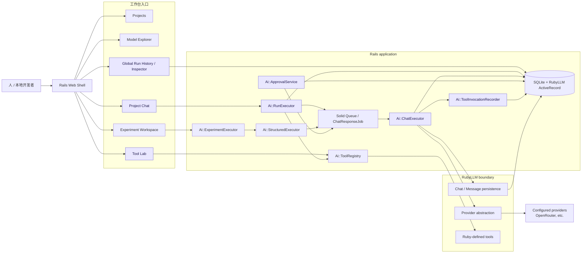
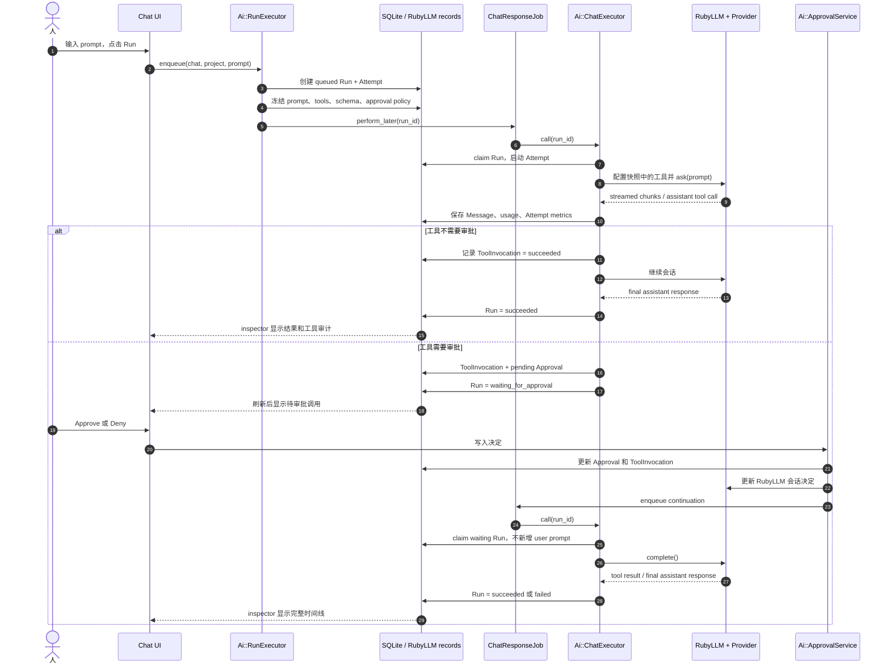
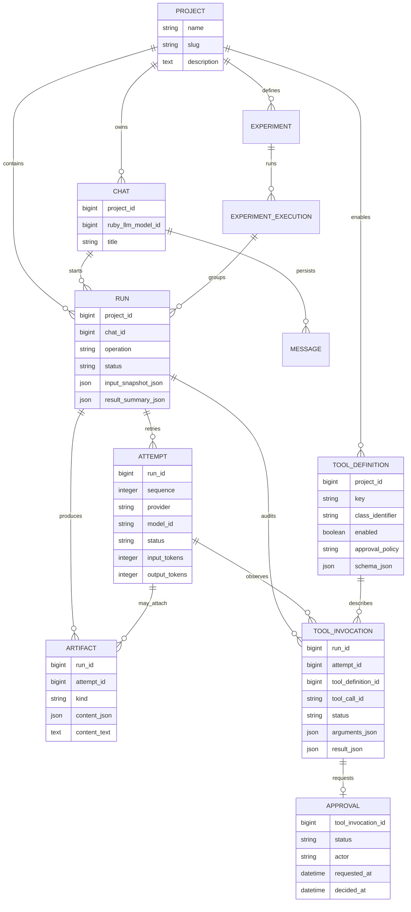
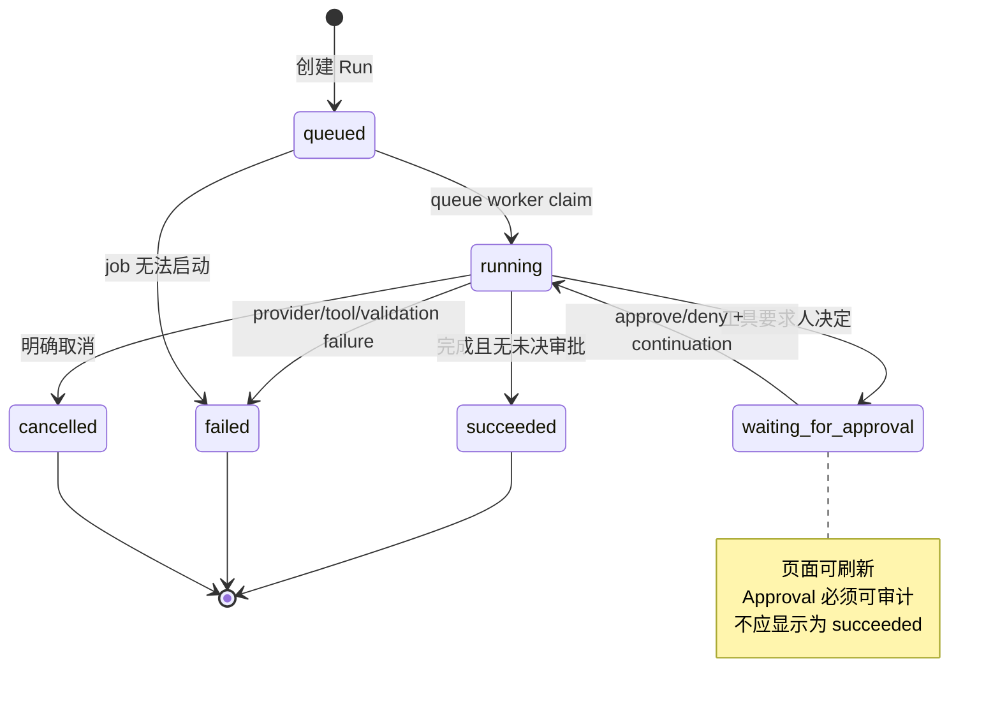

# RubyLLM Workbench 架构与流程图

图表用于恢复整体关系。它们是面向人的结构说明，不是自动从数据库 schema
生成的图；新增实体、状态、队列或 provider 边界时必须同步维护。

更新时间：2026-09-16
当前实现：M0–M3 核心闭环

## 1. 系统总览：人从哪里进入，证据在哪里落下

读图方式：

- 人只接触工作台入口；provider SDK/HTTP 不应该从 controller 旁路进入。
- `Run` 是连接 UI、队列、RubyLLM 和数据库的核心证据节点。
- Tool Lab 管的是 allowlist 和 schema；实际调用由 ChatExecutor/RubyLLM 产生，
  再由 ToolInvocationRecorder 标准化。
- M4 Knowledge 和 M5 Agent 不在这张当前图中作为已实现模块出现。

## 2. 带审批的 Chat Run 时序

关键点：

1. approval 是 Run 的一种真实中间状态，不是前端 loading 文案。
2. continuation 通过已有会话完成，不重复提交原始 prompt。
3. Run claim 防止审批请求和队列 worker 竞争时重复执行。
4. 如果工具抛异常，系统记录安全的 tool-result error 和失败 diagnostic，保留
   可继续阅读的会话结构。

## 3. 数据关系：一次执行为什么有这么多记录

读图时记住：

- `Message` 记录模型对话内容；`Run` 记录一次执行的边界和状态；二者不是重复表。
- `Attempt` 解释 provider/model 请求和重试；`Artifact` 解释可复用的耐久产物。
- `ToolDefinition` 是“允许什么”；`ToolInvocation` 是“实际发生什么”；`Approval`
  是“人是否允许发生”。
- `input_snapshot_json` 是历史证据的一部分，不能用今天的工具开关反推过去。

## 4. 状态图：哪些状态需要等待，哪些状态已经结束

Approval 自己的状态是：

`pending → approved | denied | expired`

ToolInvocation 的状态比 Run 更细：它可能先是 `requested`，等待审批，再进入
`running`、`succeeded`、`denied` 或 `failed`。因此不要只看 Run 的最终 badge 来
判断工具是否实际执行。

## 5. 里程碑图：现在在哪里，下一步是什么

```mermaid
flowchart LR
    M0["M0 Foundation\n已完成"] --> M1["M1 Chat + Runs\n已完成"]
    M1 --> M2["M2 Structured Compare\n已完成"]
    M2 --> M3["M3 Tools + Approval\n核心已完成"]
    M3 --> M3P["M3 Parallel Calls\n下一项"]
    M3P --> M4["M4 Knowledge + RAG\n延期"]
    M4 --> M5["M5 Agents + Research\n延期"]
    M5 --> M6["M6+ Media / Batch / Ops\n延期"]

    classDef done fill:#e7f6ed,stroke:#3a8f5a,color:#174b2b;
    classDef current fill:#e9e7ff,stroke:#6558d3,color:#211b4d;
    classDef next fill:#fff4d6,stroke:#b27a00,color:#654600;
    classDef deferred fill:#f1f2f4,stroke:#89909b,color:#4c535d;
    class M0,M1,M2 done;
    class M3 current;
    class M3P next;
    class M4,M5,M6 deferred;
```

里程碑不是“功能越多越好”的排行榜。每进入下一个阶段，都要先把上一个阶段的
失败边界、可恢复性和证据写清楚；否则新能力只会增加人无法理解的状态数量。
