# RubyLLM Workbench 架构与流程图

这些图是仓库内的当前实现视图，用来帮助人恢复系统关系。它们不是从数据库自动生成的
ERD，也不是未来架构承诺；具体字段和行为仍以代码、迁移、测试和运行证据为准。

更新时间：2026-09-21
当前实现：M0–M3 核心闭环、本地 LifecycleEvent 目录、并行策略切片和 M4 Knowledge 检索/rerank/文件来源 `IMPLEMENTED`；M5 Agent、M6 speech/image/video/transcription、M7 evaluation 和 M8 Run export 首片 `PARTIAL`
当前图表范围：已验证的本地运行路径；未来节点全部显式标为 `PLANNED`
校准依据：routes、models、migrations、jobs、services、测试、M3 OpenRouter
dogfood（Run #11、Run #13）、M4 Knowledge 本地回归和 M5 Agent 边界测试

## 读图规则

- 先看 L0，得到系统边界；再看 L1，定位代码职责；最后按问题查看数据、时序或状态图。
- `Run` 是一次用户可理解的执行边界；`Attempt` 是其中一次 provider/model 请求。
- `ToolDefinition` 表示“允许什么”，`ToolInvocation` 表示“实际请求了什么”，
  `Approval` 表示“人做了什么决定”。
- `LifecycleEvent` 是按时间索引这些变化的本地元数据记录，不替代原始业务记录，
  也不等同于 provider tracing。
- `ToolExecutionPolicy` 把 Project 的串行/并行意图与 RubyLLM 的
  `calls`/`concurrency` 选项绑定到每个新 Run；不满足能力或安全条件时显式降级。
- `PLANNED` 节点不是当前系统已经存在的运行时组件，不能从图中推断出实现。

## 1. L0 — 当前系统上下文

这张图只回答“谁进入系统、系统经过哪条边界、证据落在哪里”。

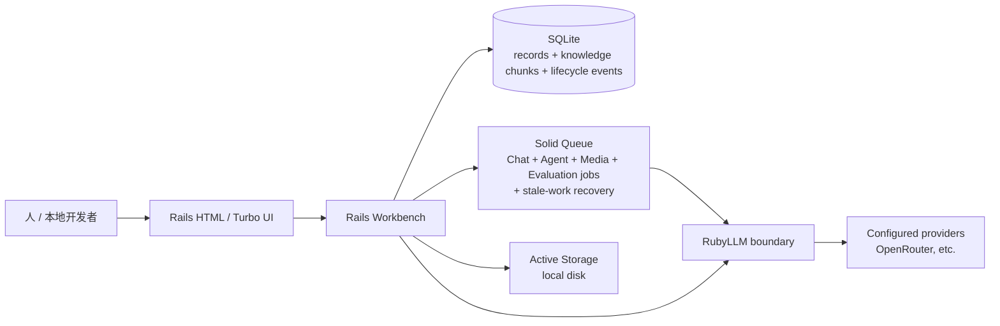

当前含义：provider 操作从 RubyLLM 边界进入；Run、Message、Attempt、Artifact、AgentDefinition、EvaluationComparison/Evaluation
dataset/revision/execution/case、工具调用、审批、KnowledgeItem/KnowledgeChunk 和 LifecycleEvent 等证据落在本地持久化层；队列负责 Chat、Agent continuation、speech/image/video/transcription、evaluation cases 和 stale-work recovery。远程部署、账号、
外部数据库和公开访问不属于这张当前实现图。

## 2. L1 — 已实现组件如何连接

这张图缩小了节点数量，只保留人需要定位职责的组件。

```mermaid
flowchart TD
    subgraph UI["工作台页面"]
        ProjectUI["Project shell"]
        ChatUI["Project Chat"]
        SpeechUI["Saved assistant reply speech action"]
        MediaUI["Image/video generation + audio transcription"]
        ExperimentUI["Experiment workspace"]
        ToolUI["Tool Lab"]
        KnowledgeUI["Knowledge workspace"]
        AgentUI["Agent definitions + task form"]
        EvaluationUI["Evaluation datasets + case results"]
        RunUI["Run history / inspector"]
    end

    RunExecutor["Ai::RunExecutor\n(chat submission)"]
    ExperimentExecutor["Ai::ExperimentExecutor\n(structured submission)"]
    StructuredExecutor["Ai::StructuredExecutor"]
    ChatJob["ChatResponseJob"]
    AgentRunExecutor["Ai::AgentRunExecutor"]
    AgentJob["AgentRunJob\nActiveJob::Continuable"]
    AgentReportRecorder["Ai::AgentResearchReportRecorder"]
    SpeechExecutor["Ai::SpeechRunExecutor + SpeechCatalog"]
    SpeechJob["SpeechRunJob"]
    SpeechRecovery["SpeechRunRecoveryJob\n30 minute stale failure"]
    MediaRuns["ImageRunJob + VideoRunJob + TranscriptionRunJob\nMediaRunRecoveryJob"]
    EvaluationExecutor["Ai::EvaluationExecutor"]
    EvaluationJob["EvaluationCaseJob + recovery"]
    ReproductionExporter["Ai::RunReproductionExporter"]
    AgentDefinition["AgentDefinition\nproject-scoped revision"]
    StructuredJob["StructuredResponseJob"]
    ChatExecutor["Ai::ChatExecutor"]
    CitationRecorder["Ai::CitationSetRecorder"]
    Tooling["ToolRegistry + ChatTooling\n+ ToolExecutionPolicy"]
    KnowledgeServices["Ai::Knowledge::Chunker + Ingestor\n+ Embedder + Retriever + Search\n+ VectorStore adapter"]
    Audit["ToolInvocationRecorder + ApprovalService"]
    Events["LifecycleEventRecorder\nActiveSupport Notifications"]
    ProviderEvents["Ai::RubyLlmInstrumentation\n*.ruby_llm adapter + ExecutionContext"]
    Records["Project / AgentDefinition / Evaluation / Chat / Run / Attempt\n/ Artifact / tool / Knowledge records / LifecycleEvent"]
    RubyLLM["RubyLLM Agent + Chat + embed + speak + provider boundary"]

    ChatUI --> RunExecutor
    ExperimentUI --> ExperimentExecutor
    ToolUI --> Tooling
    KnowledgeUI --> KnowledgeServices
    AgentUI --> AgentRunExecutor
    ChatUI --> SpeechUI
    ChatUI --> MediaUI
    SpeechUI --> SpeechExecutor
    SpeechExecutor --> SpeechJob
    SpeechJob --> RubyLLM
    SpeechJob --> Records
    SpeechRecovery --> Records
    MediaUI --> MediaRuns
    MediaRuns --> RubyLLM
    MediaRuns --> Records
    AgentRunExecutor --> AgentDefinition
    RunUI --> Records
    EvaluationUI --> EvaluationExecutor
    EvaluationExecutor --> EvaluationJob
    EvaluationJob --> StructuredExecutor
    EvaluationJob --> Records
    EvaluationJob --> RubyLLM
    EvaluationJob --> Events
    RunUI --> ReproductionExporter
    RunExecutor --> ChatJob
    ExperimentExecutor --> StructuredJob
    StructuredJob --> StructuredExecutor
    ChatJob --> ChatExecutor
    AgentRunExecutor --> AgentJob
    AgentJob --> RubyLLM
    AgentJob --> AgentReportRecorder
    AgentReportRecorder --> Records
    ChatExecutor --> RubyLLM
    ChatExecutor --> CitationRecorder
    CitationRecorder --> Records
    ChatExecutor --> Audit
    AgentJob --> Audit
    Audit --> Records
    RunExecutor --> Events
    ChatExecutor --> Events
    AgentJob --> Events
    StructuredExecutor --> Events
    SpeechJob --> Events
    Events --> Records
    ProviderEvents --> Records
    RubyLLM -. "instrumentation" .-> ProviderEvents
    Tooling --> ChatExecutor
    RunExecutor --> Records
    StructuredExecutor --> Records
    ReproductionExporter --> Records
    KnowledgeServices --> Records
    KnowledgeServices --> RubyLLM
```

代码职责的简化记忆：

1. Controller 只接收页面意图；`Ai::RunExecutor`、`Ai::AgentRunExecutor` 或
   `Ai::ExperimentExecutor` 创建带快照的执行边界。
2. Job 把 Chat Run 交给 `Ai::ChatExecutor`，Agent Run 使用 `AgentRunJob` 从快照恢复 RubyLLM
   Agent；结构化流程再由 `Ai::StructuredExecutor` 负责 schema、validation 和 Artifact。
3. `ToolRegistry`/`ChatTooling` 只允许代码中已注册的工具；Recorder 和
   `ApprovalService` 把调用及人的决定变成可检查记录。
4. `CitationSetRecorder` 把响应引用链接到执行它的 Run 和 Attempt；provider 搜索步骤则
   继续保留在 RubyLLM Message 中。
5. provider/conversation 语义仍由 RubyLLM 承担，应用不旁路调用 provider SDK 或 HTTP。

## 3. L2 — 当前持久化关系

这是当前代码中已落地的主要关系；Message 是 RubyLLM 的持久化记录，不能与 Run
混为一谈。

```mermaid
erDiagram
    PROJECT ||--o{ CHAT : owns
    PROJECT ||--o{ EXPERIMENT : defines
    PROJECT ||--o{ AGENT_DEFINITION : defines
    PROJECT ||--o{ TOOL_DEFINITION : enables
    PROJECT ||--o{ KNOWLEDGE_COLLECTION : owns
    PROJECT ||--o{ RUN : contains
    PROJECT ||--o{ EVALUATION_COMPARISON : owns
    CHAT ||--o{ MESSAGE : persists
    CHAT ||--o{ RUN : starts
    PROJECT ||--o{ EVALUATION_DATASET : owns
    EVALUATION_DATASET ||--o{ EVALUATION_DATASET_REVISION : versions
    EVALUATION_DATASET_REVISION ||--o{ EVALUATION_COMPARISON : evaluated
    EVALUATION_DATASET_REVISION ||--o{ EVALUATION_EXECUTION : evaluated
    EVALUATION_COMPARISON ||--|{ EVALUATION_EXECUTION : compares_models
    EVALUATION_EXECUTION ||--o{ EVALUATION_CASE_RESULT : measures
    EVALUATION_CASE_RESULT }o--o| RUN : links
    EXPERIMENT ||--o{ EXPERIMENT_EXECUTION : runs
    EXPERIMENT ||--o{ RUN : defines
    EXPERIMENT_EXECUTION ||--o{ RUN : groups
    RUN ||--o{ ATTEMPT : retries
    RUN ||--o{ ARTIFACT : produces
    RUN ||--o{ TOOL_INVOCATION : audits
    RUN ||--o{ LIFECYCLE_EVENT : explains
    ATTEMPT ||--o{ ARTIFACT : may_attach
    ATTEMPT ||--o{ TOOL_INVOCATION : observes
    ATTEMPT ||--o{ LIFECYCLE_EVENT : annotates
    ARTIFACT ||--o{ LIFECYCLE_EVENT : annotates
    TOOL_INVOCATION ||--o{ LIFECYCLE_EVENT : annotates
    APPROVAL ||--o{ LIFECYCLE_EVENT : annotates
    TOOL_DEFINITION ||--o{ TOOL_INVOCATION : describes
    TOOL_INVOCATION ||--o| APPROVAL : requests
    KNOWLEDGE_COLLECTION ||--o{ KNOWLEDGE_ITEM : contains
    KNOWLEDGE_ITEM ||--o{ KNOWLEDGE_CHUNK : splits

    PROJECT {
        bigint id
        string name
        string slug
        text description
        json settings_json
    }
    AGENT_DEFINITION {
        bigint project_id
        integer revision
        string provider
        string model_id
        text instructions
        json tool_keys_json
        json provider_tools_json
        json options_json
    }
    CHAT {
        bigint project_id
        bigint ruby_llm_model_id
        string title
    }
    MESSAGE {
        bigint chat_id
        string role
        text content
    }
    EXPERIMENT {
        bigint project_id
        integer revision
        string status
        json schema_json
    }
    EXPERIMENT_EXECUTION {
        bigint experiment_id
        string status
        json input_snapshot_json
    }
    EVALUATION_DATASET {
        bigint project_id
        string name
        integer current_revision
    }
    EVALUATION_DATASET_REVISION {
        bigint evaluation_dataset_id
        integer revision
        json cases_json
    }
    EVALUATION_COMPARISON {
        bigint project_id
        bigint evaluation_dataset_revision_id
        bigint experiment_id
        json experiment_snapshot_json
        json model_targets_json
    }
    EVALUATION_EXECUTION {
        bigint project_id
        bigint evaluation_comparison_id
        bigint evaluation_dataset_revision_id
        bigint experiment_id
        string provider
        string model_id
        string status
    }
    EVALUATION_CASE_RESULT {
        bigint evaluation_execution_id
        bigint run_id
        string case_key
        string status
        boolean passed
        string transport_status
        string schema_status
    }
    RUN {
        bigint project_id
        bigint chat_id
        bigint experiment_id
        bigint experiment_execution_id
        string operation
        string status
        json input_snapshot_json
        json result_summary_json
    }
    ATTEMPT {
        bigint run_id
        integer sequence
        string provider
        string model_id
        string status
        integer input_tokens
        integer output_tokens
    }
    ARTIFACT {
        bigint run_id
        bigint attempt_id
        string kind
        json content_json
        text content_text
    }
    LIFECYCLE_EVENT {
        bigint run_id
        bigint attempt_id
        bigint artifact_id
        bigint tool_invocation_id
        bigint approval_id
        string name
        string event_key
        string source
        datetime occurred_at
        integer duration_ms
        json payload_json
    }
    TOOL_DEFINITION {
        bigint project_id
        string key
        string class_identifier
        boolean enabled
        string approval_policy
        json schema_json
    }
    TOOL_INVOCATION {
        bigint run_id
        bigint attempt_id
        bigint tool_definition_id
        string tool_call_id
        string status
        json arguments_json
        json result_json
    }
    APPROVAL {
        bigint tool_invocation_id
        string status
        string actor
        datetime requested_at
        datetime decided_at
    }
    KNOWLEDGE_COLLECTION {
        bigint project_id
        string name
        text description
    }
    KNOWLEDGE_ITEM {
        bigint knowledge_collection_id
        string title
        string source_kind
        string source_reference
        text content_text
        string checksum
        string ingestion_status
        json metadata_json
    }
    KNOWLEDGE_CHUNK {
        bigint knowledge_item_id
        integer position
        text content_text
        integer char_start
        integer char_end
        json metadata_json
    }
    KNOWLEDGE_EMBEDDING {
        bigint knowledge_chunk_id
        string provider
        string model_id
        integer dimensions
        binary vector
        string content_checksum
        string status
        json metadata_json
    }
```

读取关系时记住：

- Experiment 定义可复用的结构化任务；Execution 冻结一次运行；child Run 各自保存
  provider/model 结果，所以一个失败不会被另一个成功覆盖。
- `input_snapshot_json` 是历史证据：之后的工具开关、schema 或模型选择不能回写它。
- Artifact 是可复用的产物，不取代原始 Chat、Run、Attempt 和工具审计。
- LifecycleEvent 只保存允许的 ID、状态、provider/model、时长和错误类别等元数据；
  prompt、工具参数、工具结果和 Artifact 内容仍由原始记录负责。`event_key` 用于
  幂等去重，旧 Run 不做迁移后的合成回填。
- AgentDefinition 是可编辑的 Project 模板；启动 Agent Run 时会把定义 id/revision、模型、
  instructions、工具选择、options 和 prompt 复制进 `Run.input_snapshot_json`。每个 Agent Run
  创建专属 Chat；Run 与 AgentDefinition 不建外键，删除模板不会删除或改写旧 Run。

KnowledgeItem 保存规范化后的文本与 checksum，文本可以来自粘贴，也可以来自 Active Storage
附件（`source_kind: file`）：附件先经 `DocumentExtractionJob` 抽取（本地读取或
provider OCR），抽取结果写成 `ocr_document` Artifact 作为 provenance，再交给同一个
`Ingestor` 分块。Artifact 因此有两种 owner：Run（执行证据）或 KnowledgeItem（文档
provenance），`run_id` 已改为可选。KnowledgeChunk 保存可重复生成的
内容窗口、位置和字符 offset。KnowledgeEmbedding 按 (chunk, model_id) 唯一保存
provider、dimensions、packed Float32 vector 与 content checksum；检索只在同一
model_id 内比较，stale checksum 会被跳过，所以不同模型或维度的向量不会被混用。
向量读写经过 `Ai::Knowledge::VectorStore` adapter 接口。默认实现是应用侧 cosine，
只适用于有界语料；opt-in 的 `sqlite_vector_extension` 用外部 sqlite-vector 扩展做
exact cosine 扫描。后者不直接扫 `knowledge_embeddings.vector`（该列混合多个模型的
维度，而扩展要求每列一个固定 dimension 且不检查单行 blob 长度），而是读写按维度划分
的派生索引表 `knowledge_vector_index_<dimension>`；该表不在 `db/schema.rb` 中，可
由源表重建。扩展不可用时 registry 回退到默认 adapter 并写明原因。

### 当前存在的部分实现

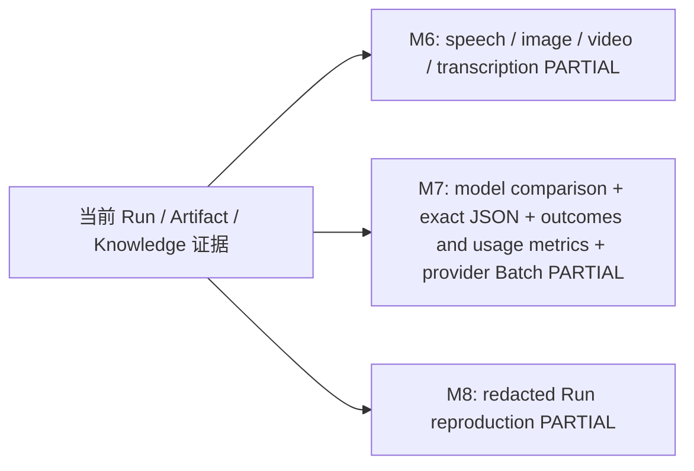

媒体 Artifact、EvaluationDataset revision、EvaluationExecution/CaseResult 和 Run reproduction export
已经进入当前 schema 与页面；provider dogfood、更广 evaluation 和 upstream-gap 工作流仍在路线图中。

## 4. Runtime — 带审批的 Chat Run

这条路径已经用本地 fake provider 测试，并用 OpenRouter Run #13 做过真实 dogfood。
重点是 continuation 使用已有 RubyLLM 会话，不再次追加原始 user prompt。

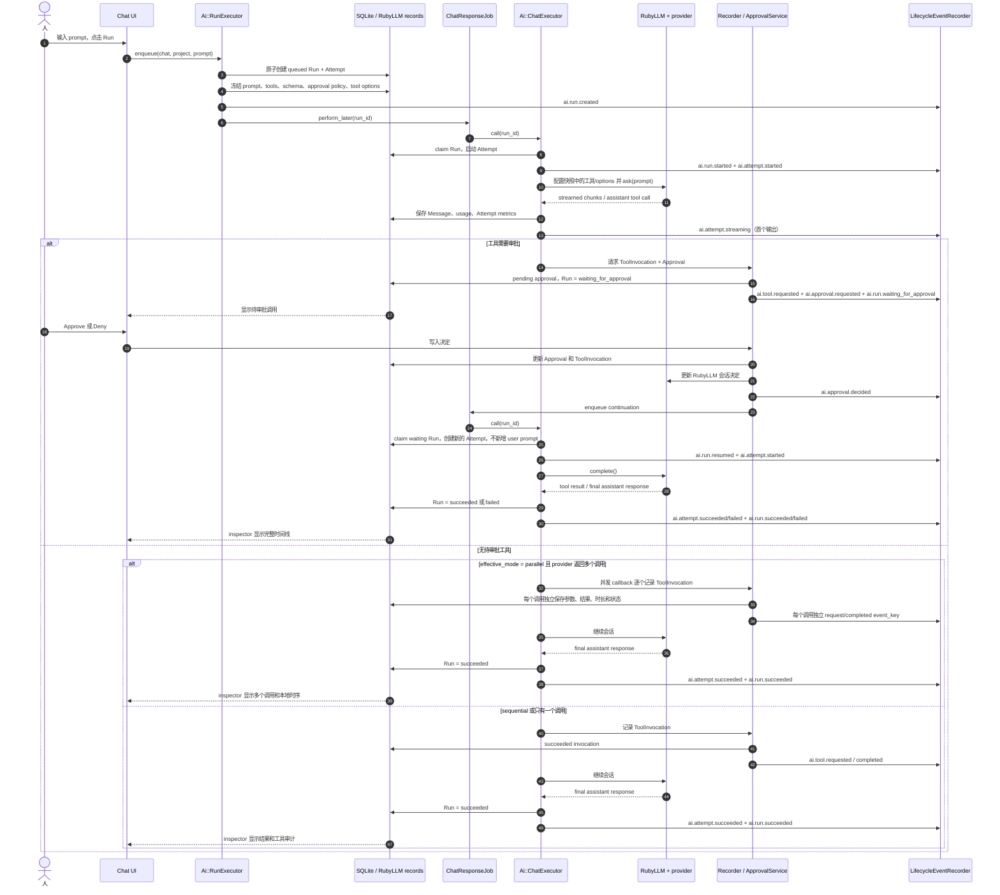

安全边界：Tool Lab 管理的是 Project-scoped allowlist；浏览器输入不能上传 Ruby，
也不能把任意 shell/code 变成工具。参数和结果展示会过滤明显的 secret 字段。

事件记录是同一条本地执行路径的元数据索引；如果事件持久化失败，主 Run/Attempt
执行不会因此失败，原始业务记录仍是事实来源。

## 4.1 Runtime — 并行 tool-call 策略

并行是应用侧的显式 opt-in，不是 provider 能力的默认假设。创建 Chat Run 时，策略
读取 Project 的 `tool_execution_mode`、当前模型的 `parallel_tool_calls` capability 和
enabled registry 工具的 `parallel_safe?` 声明，然后把结果冻结到 `input_snapshot`：

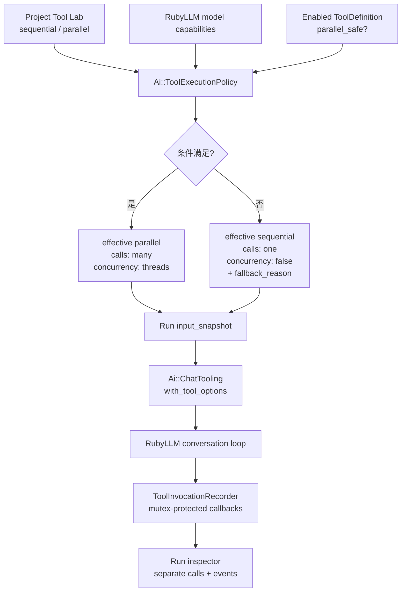

当前两个 registry 工具中，`project_snapshot` 声明可并行，`save_run_note` 创建
Artifact，因此声明为 sequential-only。若使用 parallel 模式但启用了后者，策略会
保留用户的 requested mode，同时把 effective mode 和 fallback reason 写成可检查的
串行结果。此图有本地 deterministic tests 的证据；尚无 live provider 返回多个并行
调用的验收证据。

## 4.2 Runtime — M4 知识检索（lexical / semantic / hybrid）

Knowledge collection 是 Project 下独立的产品数据流，不是一次 Chat Run。用户粘贴
文本后，应用先规范化并计算 SHA-256，再在一个事务内替换该来源的 chunks；embed 时
按 chunk 向 provider embedding model 取向量并落库；查询只读 `ready` 来源，按 mode
返回可检查的证据分量。

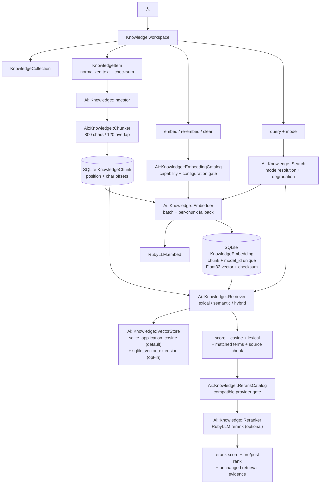

每次查询的降级都是显式的：semantic/hybrid 需要已选择的 embedding model、已配置的
provider、已存储的向量和一次 query embedding；任一项缺失时 `Search` 返回 lexical
证据并在页面上写明 requested mode 与实际原因。rerank 是可选的第二阶段：只有通过
`RerankCatalog` 的能力门控（registry 的 `rerank` output modality + provider 已配置）
才会调用，它只改变顺序并记录 `rerank_score` 与 `pre_rank`；不可用或失败时保留原证据并
说明理由。该路径不创建 `Run`/`Attempt`；文件上传和本地抽取属于独立的 Knowledge
ingestion path，并通过 provenance Artifact 表达，provider file reference、真实
OCR/page-level evidence 仍是边界外能力。

## 4.3 Runtime — 保存的 Agent Run

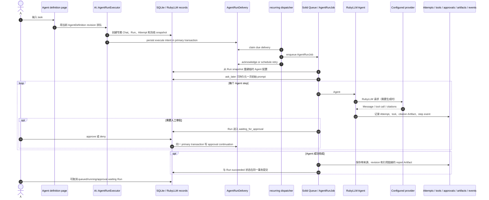

`AgentRunJob` 把多步执行交给 Rails 8.1 `ActiveJob::Continuable`，在 step 边界 checkpoint；每次
worker 执行都会从 Run snapshot 和专属 Chat transcript 重建 Agent。Run 行上的随机 owner token、递增
generation 和 5 分钟到期租约阻止同一 Run 被两个有效 owner 同时接管；存活 worker 每 15 秒续租。续租
遇到可识别的临时数据库错误时会重试，仍无法确认 owner 时会安排恢复投递。消息占位与完成记录、usage、
流式输出记录、provider lifecycle event 和当前本地工具数据库写入都会在 Run 行锁内校验 owner；迟到的
通用 Job 不能把 `waiting_for_approval` 改回 `running`。一轮包含多个待审批调用时，只有全部调用都已有
决定，审批续跑才会携带具体 invocation id 与暂停代次接管 Run。

恢复仍遵循至少一次语义：provider 已接受的请求无法因租约丢失而撤销，可能发生重复请求或费用；但旧 owner
迟到的响应不会写入 Chat transcript 或 usage。Agent 启动时会比较冻结的本地工具 schema/policy 快照与当前
注册 contract，发现 drift 就停止，要求创建新 Run；若 Agent 选择了本地工具，还会在定义保存、
Run 入队和每次 worker 恢复时要求精确模型条目显式声明 `function_calling`。这只是 RubyLLM registry
准入提示，不代表真实 provider/model 已接受工具调用。provider-hosted `web_search` 不经过这条本地工具门槛。
内置只读 `project_snapshot` 无需副作用去重；
`save_run_note` 在 Run 锁内按 RubyLLM tool-call id 唯一复用 Artifact。未来有副作用的工具仍需各自实现
原子租约检查和幂等性。RubyLLM 会先创建空 assistant 占位消息；恢复时若只找到该占位，会将 Attempt
记为失败、删除占位并重新请求，不会把空结果报告为成功。初始 Run、审批续跑与恢复意图先写入 primary
数据库 outbox，再由每分钟 dispatcher 投递到独立 Solid Queue 数据库；dispatcher 也扫描未领取 Run、过期
租约和所有审批均已决定的等待 Run。投递失败会保留并退避重试。队列写入与 outbox 确认无法跨数据库原子
提交，因此确认前崩溃仍可能重复投递；Run lease/generation 会拒绝迟到 owner。开发与生产都必须运行
Solid Queue recurring scheduler，才能持续派发和扫描。完整 Agent job 回归、并发取消竞态和 forked worker
终止/替换后的 `save_run_note` 重放均已有本地自动化证据；真实 provider 请求与生产环境 scheduler 运维仍需
在对应环境验证。Runtime inspector 会把 Web 响应与 Background jobs readiness 分开，读取 Scheduler、Dispatcher、
maintenance Worker 的最近心跳、Agent dispatcher schedule 和到期 outbox 数量；这反映队列进程状态，不证明 provider
可达或单个 Job 成功。成功结束时，`Ai::AgentResearchReportRecorder` 从最终持久化 assistant Message 创建 Run-owned
`report` Artifact，并关联最后一次 Attempt、冻结的 Agent revision 与该 Run 的 citation-set Artifacts；报告与
Run 的 `succeeded` 状态在同一锁定事务中提交。取消或失败不会生成报告，重复记录同一最终消息会复用现有 Artifact。

## 5. Runtime — 状态如何推进

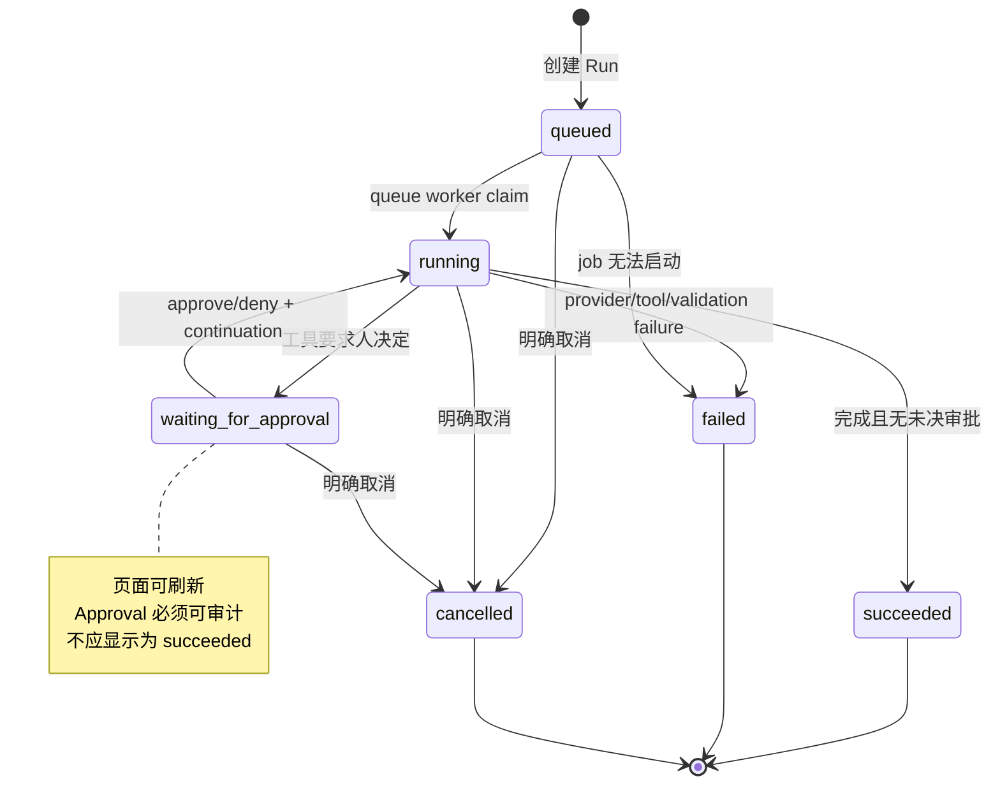

Approval 自己的状态是 `pending → approved | denied | expired`。ToolInvocation 更细，
可能经历 `requested → running → succeeded | failed`，也可能在决定后进入 `denied`。
因此不能只看 Run 的最终 badge 判断工具是否真的执行。

## 6. Runtime — LifecycleEvent 目录如何落地

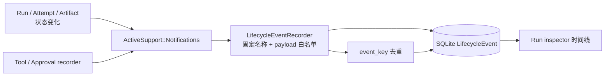

来自 provider 的通知走独立路径：RubyLLM 2.0 会发出 `chat.ruby_llm`、
`tool_call.ruby_llm` 等事件，但 payload 里的 `chat` 是它自己的 `RubyLLM::Chat`，
拿不到应用记录。`Ai::ExecutionContext` 因此在执行期间发布当前 Run/Attempt，
`Ai::RubyLlmInstrumentation` 用这个上下文关联，并只白名单少量标量，写成
`ai.provider.*` 事件（`source = ruby_llm`）。没有 Run 可挂的事件（知识流的
embedding/rerank）按设计不写入目录。

当前应用侧事件名称按六组组织：

- Run：`created`、`started`、`resumed`、`waiting_for_approval`、`succeeded`、`failed`、`cancelled`；
- Agent：`step`（step number、definition revision 和状态）；
- Attempt：`started`、`streaming`、`succeeded`、`failed`、`cancelled`；
- Tool：`requested`、`completed`；
- Approval：`requested`、`decided`；
- Artifact：`created`。

事件 payload 只允许关联 ID、状态、provider/model、时长、错误类别和验证结果等
元数据，不复制 prompt、工具参数、工具结果或 Artifact 内容。这个目录已经足够
支持当前 Run inspector 的本地时间线，但不构成 provider-native tracing、分布式
事件总线、成本 dashboard 或历史回填。

## 7. Milestone — 基线与当前实现的距离

```mermaid
flowchart LR
    M0["M0 Foundation\nIMPLEMENTED"] --> M1["M1 Chat + Runs\nIMPLEMENTED"]
    M1 --> M2["M2 Structured Compare\nIMPLEMENTED"]
    M2 --> M3["M3 Tools + Approval\nIMPLEMENTED"]
    M3 --> M3P["M3 Parallel Calls\nAPP PATH IMPLEMENTED"]
    M3P --> M4["M4 Knowledge\nRETRIEVAL + RERANK + DOCUMENT SOURCES\nLOCAL PATH IMPLEMENTED"]
    M4 --> M5["M5 Agent Runs\nM5.1 search + M5.2 saved agents + M5.3 report Artifact\nPARTIAL"]
    M5 --> M6["M6 Media\nspeech / image / video / transcription PARTIAL"]
    M6 --> M7["M7 Evaluation\nimmutable cross-model summaries + exact JSON + provider Batch code\nPARTIAL; fake paths locally verified"]
    M7 --> M8["M8 Run Reproduction Export\nredacted JSON slice PARTIAL"]
```

`APP PATH IMPLEMENTED` 的含义是：Project opt-in、能力/安全门控、Run snapshot 和
多调用本地审计路径已经存在并通过 deterministic tests；live provider 的并行返回和
跨 provider 兼容性仍是 `PARTIAL`。M4 当前已实现本地 text collection、chunk、
embedding 记录、SQLite vector adapter 与 lexical/semantic/hybrid 证据，并有
OpenRouter embedding/rerank model 的 dogfood 记录，以及文件上传、本地抽取和 provenance
Artifact 的本地回归；provider file references、真实 OCR/page-level evidence 和更广跨
provider 兼容性仍未完成，不能被简化成完整 M4，也不能把当前本地检索误写成 provider RAG。
M5.1 已接入每次 Run 单独 opt-in 的 provider web search，搜索步骤和来源关联到对应 Run，
标准化 citations 另存为 Run Artifact。M5.2 增加了版本化 AgentDefinition、专属 Chat/Run snapshot、
带 generation-fenced lease 的 Agent step worker、transcript/usage/tool 写入保护、工具 contract drift 检查、
幂等笔记 Artifact、审批续跑和取消状态。M5.2 现在有冻结快照、outbox 派发/重试、过期 lease 和审批恢复、
generation fencing、取消终态及 step/citation 时间线关联的确定性自动化测试；假 Agent 也通过
`AgentRunJob#perform` continuation 完成两步成功、approved/denied `save_run_note`、过期 lease 后空响应恢复和
late-response cancellation 路径。
Run 取消也会在同一事务中过期待审批并结束未完成的 ToolInvocation，记录独立的 approval/tool 生命周期事件；
系统按实际待处理状态清理审批，因此 Run 仍是 `running`、审批记录已保存但 `waiting_for_approval` 尚未提交时也会为本地调用写入拒绝结果、为远程调用保存 RubyLLM 协议响应，并避免留下 Chat 级取消标志。
M5.5 将 RubyLLM 2.0 Responses/MCP 持久化的 provider-hosted pending ToolCall 同步为本地 Approval，并在 Chat 页标明它由 provider 执行；批准或拒绝沿用现有 Chat/Agent 决策服务与 durable continuation，RubyLLM Responses 将决定写成 `mcp_approval_response`。本地测试用合成 ToolCall 验证记录与 UI/协议形状，不代表真实 provider 已验收，也不代表其他 hosted-tool 协议兼容。
失败路径在执行 lease 校验通过后，于同一 Run 锁内结束待审批记录并把 Run 标为 failed。失败同步不会新建 pending Approval；工具错误收尾只处理当前 Run 中正在执行的本地调用。尚未开始的本地审批调用记录结构化拒绝结果，仍在等待批准的 remote MCP 调用记录 RubyLLM Responses 格式的拒绝消息，且不运行 pending 工具或发起新的 provider 请求。已批准但没有持久化结果的 remote MCP 调用保留 approved 决策，不合成拒绝响应；ToolInvocation 以 `remote_tool_outcome_unknown` 保存不确定结果，并阻止该 Chat 再创建 Run。执行中被取消且没有远程结果的调用同样标为未知。被拒的 stale lease 不会修改审批或工具记录。
聊天页同步会与 Run 取消串行化，终态 Run 不再从 RubyLLM 记录恢复旧的待审批状态。
outbox continuation 会携带新 generation，迟到的重复 delivery 会被拒绝。请求级集成测试还会从 Agent 定义页面
创建定义并启动 Run，再重载 Run inspector 检查冻结 revision、step 时间线和 citation Artifact。整体 M5 仍是
`PARTIAL`：provider-backed 执行和手动浏览器视觉验收仍待验证。
M6 当前支持从已保存的 assistant 回复排队生成语音，在 chat 页提交 image/video prompt，
以及上传音频提交 transcription。各操作使用 capability-filtered model catalog 与后台 Run；
image/audio/video 先同步上传 Active Storage Blob，再与 Run 成功和 Artifact attachment 一起提交，
事务失败或取消竞态时清理未附加 Blob；transcription 输入音频也在创建 Run 前完成上传。每天清理超过 24 小时的未附加 Blob，覆盖上传后进程退出的窗口；transcript 以文本 Artifact 保存，并把空白响应规范成空文本。Chat 入口按 RubyLLM capability catalog 提供 media 操作；没有兼容模型时显示禁用状态与原因。image、
video、speech 和 transcription 的成功及失败 Attempt/Run 写入与并发取消使用 Run 行锁保护；stale
queued Run 超过 30 分钟且未被 worker claim 时记录为 `worker_not_started`，running Run 超时则记录为
`worker_interrupted`，两者都不自动重放。定向测试覆盖 running/queued recovery、queue rejection 与取消竞态；
image/video 的迟到 provider 成功响应也不能越过 recovery 写入 Artifact。Video 使用 RubyLLM blocking poller 在 worker 中
运行；提交通知会把 provider job ID 作为 `submitted` 生命周期证据写入 Run 时间线，供排障时识别已提交任务，
M8 reproduction export 会脱敏该 ID。RubyLLM 2.0.0 没有从 provider job ID 恢复 `VideoJob` 的 public API，
且 `Video` 没有 normalized usage/cost 字段。Speech
路径已有 fake-provider 本地测试；image/video/transcription 也新增 fake-provider 集成覆盖，验证排队、
worker 执行、Artifact 元数据与 Run inspector。测试没有连接真实 provider，因此 M6 仍为 `PARTIAL`。
M7 把有界、不可变的数据集 revision 和 Experiment snapshot 对照 2–5 个结构化模型。
`EvaluationComparison` 冻结数据 revision、Experiment snapshot 和目标模型清单；每个模型各有
`EvaluationExecution`，每个 case 建立普通 Structured Run/Attempt。页面即时计算逐模型汇总与逐 case
结果矩阵，每个结果都链接回原始 Run；Expected JSON 不进入 provider prompt，判定按 JSON 结构精确比较。
`EvaluationCaseResult` 另存 transport/schema outcome。`Ai::EvaluationMetrics` 汇总
已收到、失败、取消、未知和未尝试请求；响应率/schema 有效率以已知结果为分母。
Individual latency 使用 app-observed Attempt 时长，仅在样本数达到 20 时给出 p95；provider Batch
等待和刷新时长不混入请求延迟。Token 与 reported/estimated cost 显示采集覆盖，成本按币种分别统计。
这些指标描述本地观察到的执行，不代表 provider 可用率或模型质量。
`EvaluationCaseReview` 允许对已完成输出追加 `acceptable`、`needs_work` 或 `inconclusive`
人工评审，并记录自报 reviewer label 与可选理由；
历史记录不能经界面修改或删除，也不会改变 exact-JSON `passed` 或 `Ai::EvaluationMetrics`。
每个 case 可选定义 1–8 个有界 rubric criteria。启用 rubric 后，每条 review 必须给每个 criterion
记录 `meets`、`partially_meets`、`does_not_meet` 或 `not_applicable`；页面按单个 case 汇总各 rating
的次数和样本数，不跨 case 混合，也不生成加权或总分。Rubric 冻结在 revision、case result 和 Run 的本地
evaluation context 中，不进入 provider prompt；rubric 专项测试为 18 runs、237 assertions、无失败或错误。
每个 case 可上传最多 5 个 10 MB 文件，每个 dataset revision 最多 50 个文件且总计最多 50 MB，仅接受文本、JSON、CSV、PDF、JPEG 和 PNG。
文件以 revision-owned Active Storage 记录保存，新增/移除都会创建新 revision；旧 revision 保留原文件，Project 删除触发 Blob 清理。
附件元数据只进入本地 revision/Run snapshot；Structured individual 与 provider Batch prompt 均不包含文件名、内容或 ID。
附件专项测试为 8 runs、87 assertions；没有 provider 调用。50 个文件和 50 MB 均为单 dataset revision 限额，没有 dataset/Project 生命周期累计限额，重复上传会增加保留存储。
Reviewer label 不是认证身份。可选自动 rubric judge 会把 case input、生成输出和 rubric
发送给指定 judge provider，expected output、tags 与 attachments 不发送；Judge 使用独立 Run、Attempt
与成本记录，不改变 exact-JSON 结果、人工 review 或 evaluation metrics。它是未经校准的辅助判断，
并不代表通用模型质量分数。自动化语义判断有 provider-free 专项覆盖，但真实 provider dogfood 和校准仍待完成。
case tags 保存在本地上下文，不发送给 provider。
刷新只允许重新排队尚未开始的 case；超过 30 分钟的运行 case 失败且不自动重放，Run 锁保护
迟到的结构化完成写入。另有仅对同时声明 structured-output 与 batch capability 的模型开放的
provider Batch 提交和手动刷新路径；提交 ID 不确定时不会重放。Fake Batch 测试覆盖提交 readiness、精确有序
chat-set Store 对账、未知提交的迟到 Store 恢复、按 case position 刷新、局部取消和逐例 Artifact/Attempt/token
映射。跨模型比较有 provider-free 的快照/排队/逐例 Run 与摘要请求测试。没有真实 provider 证据；未知提交经过
30 分钟等待与再次本地 store 对账后，可以由操作人员明确关闭为本地失败，但无法因此取消 provider 请求；语义评估仍未实现。
M8 首片提供每个 Run 的 JSON reproduction 下载，并允许把人工分类的 upstream candidate
保存为 append-only report Artifact，再下载包含该次脱敏 reproduction snapshot 的 Markdown issue
草稿。字段白名单、敏感键、URL userinfo、已知签名 URL 查询值、常见凭证文本与本机路径清理会应用于 Run 导出和候选文本；URL 保留 scheme、host、path 和非敏感查询值，二进制仍被排除。
既有候选报告不进入后续 reproduction bundle，避免候选草稿递归嵌套。
Chat Run 入队时冻结此前 RubyLLM 消息结构，worker 在首次 provider 请求前核对持久化上下文；
发现排队期间上下文变化就失败关闭。同一 Chat 只接受一个活动 Run。导出再用入队和完成时的
message ID 水位线加入本次 Run 写入的消息，覆盖 user/assistant/tool 消息及审批续跑中的协议字段；
附件字节仍被排除并标注为未包含。该快照固定消息上下文，不固定 provider 外部状态、运行时配置或
模型非确定性。定向 provider-free 自动化覆盖了上下文冻结、drift rejection、队列拒绝、
并发提交、审批续跑和导出水位线。既有 provider-free 自动化覆盖 candidate 校验、
append-only 保存、证据、脱敏和 Markdown 草稿；代表性真实 Run 样本审查、分类复核和外部提交由人完成。
通用脱敏也不保证能识别任意用户文本中的秘密。

## 8. 如何保持图表可信

每次新增或改变以下任一项，都要在同一主题迭代中检查本页：实体/迁移、状态转移、
队列 job、provider 边界、工具审批、Artifact 产出或页面入口。更新时：

1. 先对照 README、TODO 和相关代码，确认目标和现有限制。
2. 再对照代码、测试和实际页面，把已验证路径写成 `IMPLEMENTED` 或 `PARTIAL`。
3. 尚未落地的目标只写 `PLANNED`；被淘汰的入口写 `DEPRECATED` 或 `REMOVED`，
   不要把未来节点画成当前依赖。
4. 在 [CHANGELOG.md](CHANGELOG.md) 记录变更原因、证据和未证明的边界。

图表是帮助人理解当前系统的压缩视图，不是新的事实来源；当图与代码冲突时，应
先修正图或记录偏差，而不是用图替代代码证据。

## Evaluation Batch result integrity

`EvaluationBatchRefreshJob` collects results through `Ai::EvaluationBatchResults`. Its instance-local RubyLLM 2.0.0 workaround validates the complete normalized index set before any Chat delivery or status mutation, using the frozen evaluation case count. Duplicate, negative, non-integer and out-of-range indices stop collection; the existing refresh error path keeps cases unchanged and exposes the error. This uses the private `Batch#result_slot_count` hook and must be rechecked on RubyLLM upgrades. See [the upstream reproduction and evidence](UPGRADE_REVIEW_2026-09-26.md).

## 2026-09-27 — Run event export

`RunsController#events` → `Ai::RunReproductionExporter#events` → Run-scoped `LifecycleEvent` query. An event ID watermark excludes later inserts; timestamp/ID ordering selects the latest 100 records and returns them chronologically. The path reuses redaction and bounded serialization without loading messages, snapshots, tools or Artifacts. Related record IDs allow local joins; omitted records/values and byte-overflow fallback are explicit.
