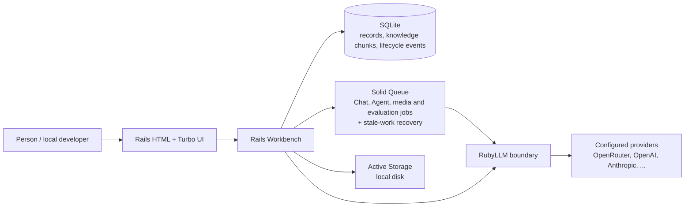
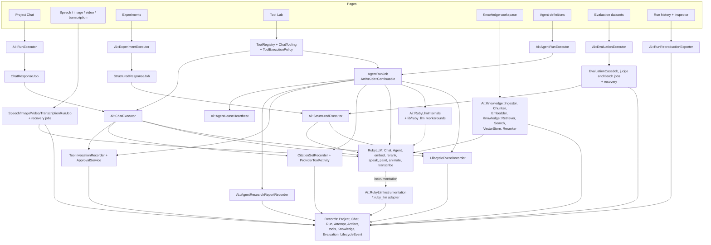
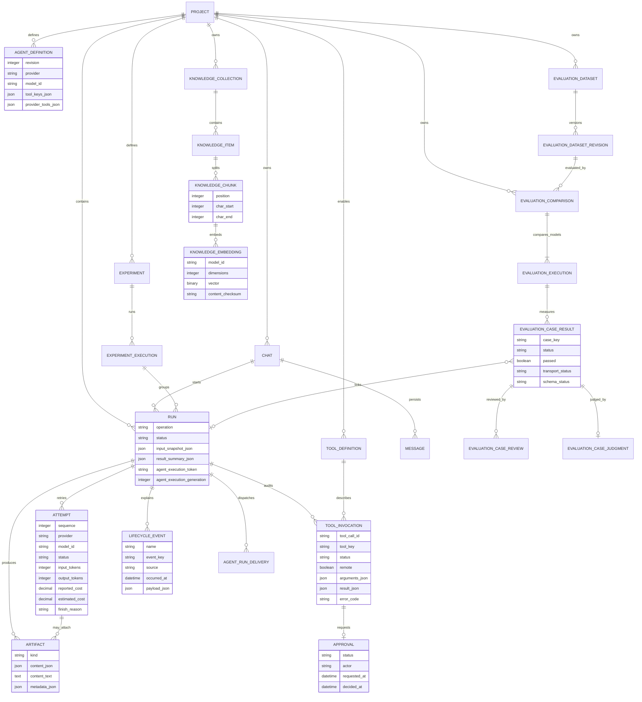
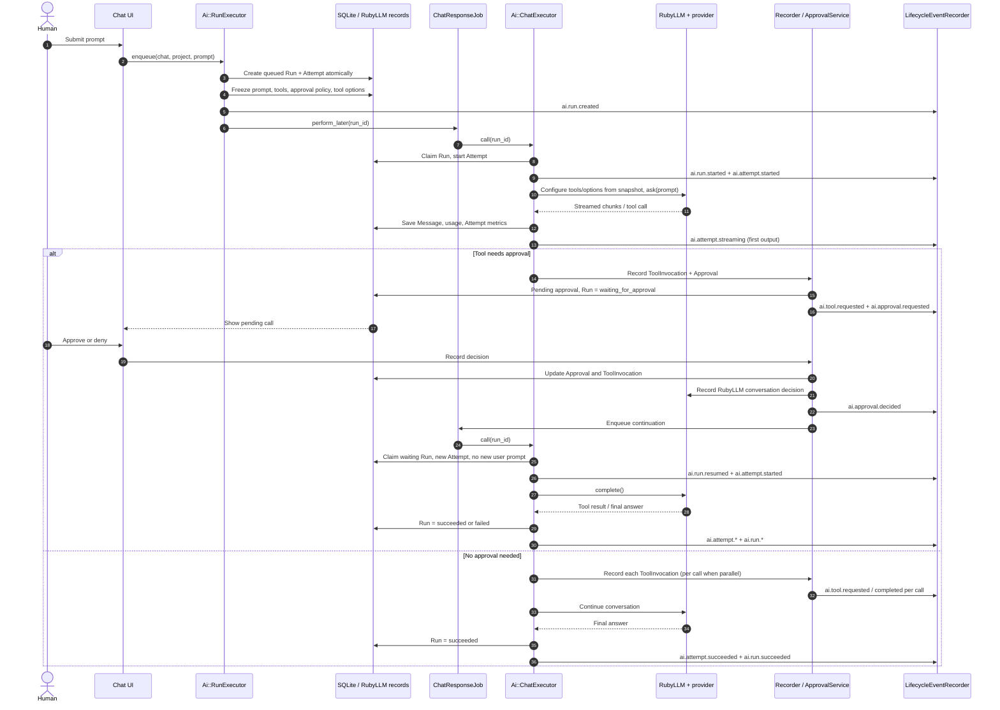
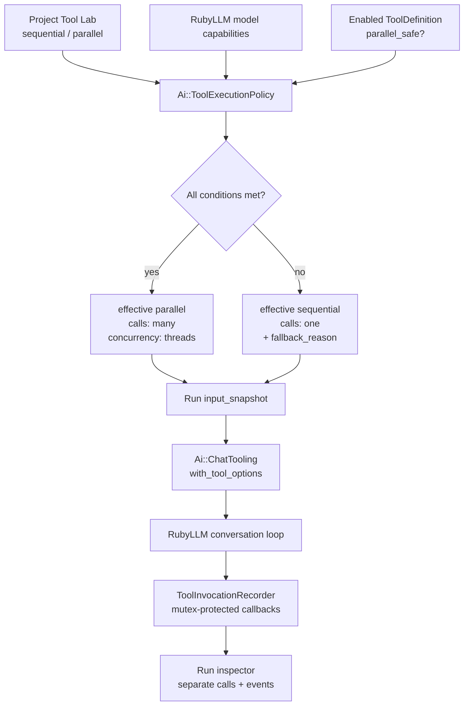
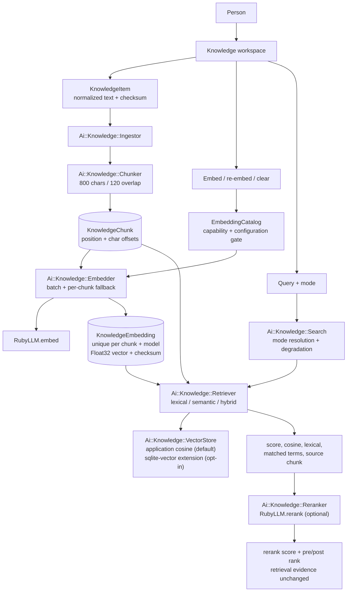
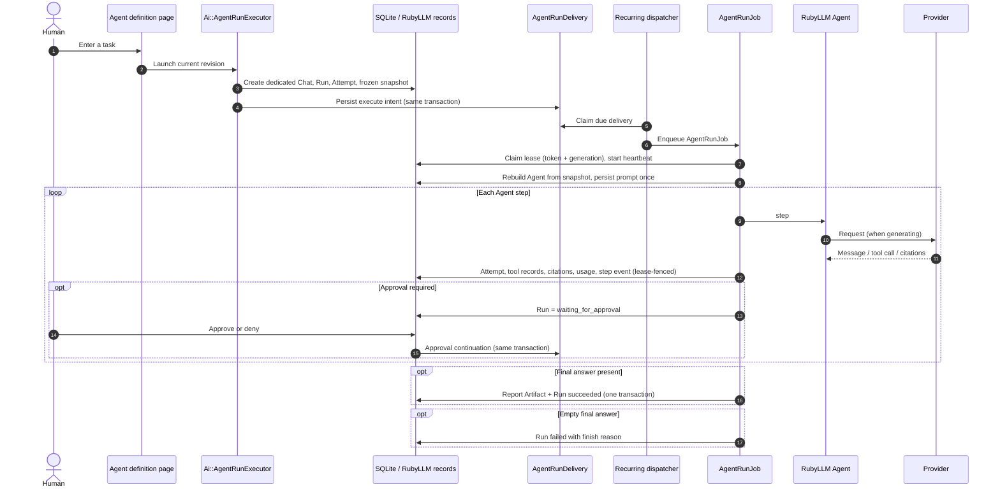
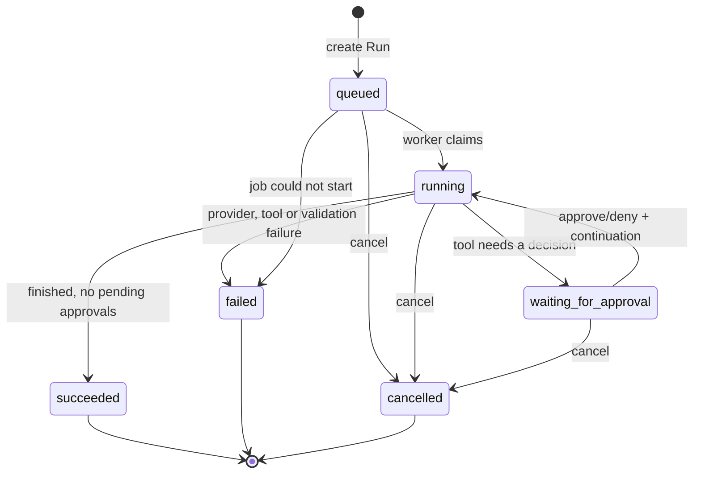
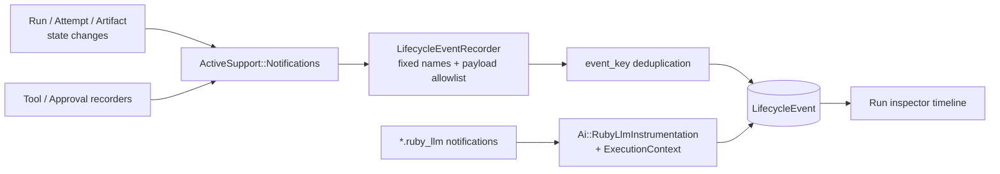

# Architecture

These diagrams are a hand-maintained view of the current implementation. They
are not a generated ERD or a promise about future design; code, migrations and
tests remain the source of truth.

Updated: 2026-09-28

## How to read the diagrams

- Start with L0 for the system boundary, then L1 for code responsibilities,
  then the data, sequence or state diagram for your question.
- A `Run` is one execution a person can reason about; an `Attempt` is one
  provider/model request inside it.
- `ToolDefinition` is what is allowed, `ToolInvocation` is what was actually
  requested, and `Approval` is what a person decided.
- `LifecycleEvent` indexes those changes over time. It does not replace the
  records and is not provider tracing.
- `ToolExecutionPolicy` binds a Project's sequential/parallel intent to
  RubyLLM's `calls` and `concurrency` options on each new Run, and falls back
  explicitly when capability or safety conditions are not met.
- Status labels: `IMPLEMENTED` exists and is tested; `PARTIAL` exists with
  incomplete evidence; `PLANNED` does not exist yet.

## 1. L0: system context

Every provider operation crosses the RubyLLM boundary; Workbench never calls a
provider SDK or HTTP API directly. Evidence lands in SQLite and Active Storage.
Remote deployment, accounts and public access are outside this picture.

## 2. L1: how the components connect

Responsibilities in short:

1. Controllers accept page intent. Executors (`RunExecutor`,
   `AgentRunExecutor`, `ExperimentExecutor`, `EvaluationExecutor`, media
   executors) create a snapshotted Run and enqueue work.
2. Jobs perform the work: `ChatExecutor` for chats, `AgentRunJob` for Agents
   (rebuilt from the Run snapshot on every resume), `StructuredExecutor` for
   schema-validated output.
3. `ToolRegistry` and `ChatTooling` expose only code-registered tools; the
   recorder and `ApprovalService` turn calls and decisions into records.
4. `CitationSetRecorder` and `ProviderToolActivity` capture provider-hosted
   evidence: citations, discrete server tool calls and usage-only counters.
5. `Ai::RubyLlmInternals` lists every private RubyLLM seam Workbench uses, and
   `lib/ruby_llm_workarounds` holds temporary, self-disabling upstream fixes.

## 3. L2: persistence

Messages are RubyLLM's persisted records; do not confuse them with Runs.

Remember when reading it:

- `input_snapshot_json` is historical evidence. Later tool toggles, schema
  edits or model choices never rewrite it.
- LifecycleEvent stores only allowlisted IDs, statuses, provider/model,
  durations and error categories. `event_key` deduplication makes recording
  idempotent; Runs from before the catalog existed are not backfilled.
- AgentDefinition is an editable template. A Run copies its revision into the
  snapshot and has no foreign key to it, so deleting a template never changes
  old Runs.
- An Artifact is owned by a Run (execution evidence) or a KnowledgeItem
  (document provenance).
- KnowledgeEmbedding is unique per (chunk, model). Retrieval compares vectors
  only within one model, and skips vectors whose checksum no longer matches
  the chunk. The opt-in `sqlite_vector_extension` adapter keeps derived
  per-dimension tables (`knowledge_vector_index_<dimension>`) that can be
  rebuilt and are not in `db/schema.rb`.

## 4. Runtime: Chat Run with approval

The continuation reuses the persisted RubyLLM conversation and never appends
the original prompt again.

Safety boundary: Tool Lab manages a Project-scoped allowlist. Browser input
cannot upload Ruby or turn shell/code into a tool, and displayed arguments and
results filter obvious secret fields. If event persistence fails, the main
execution continues; the records remain the source of truth.

## 4.1 Runtime: parallel tool-call policy

Parallel calls are an explicit application opt-in, never assumed from the
provider.

`project_snapshot` is parallel-safe; `save_run_note` writes an Artifact and is
sequential-only. There is local evidence for the policy, but no live provider
has been observed returning parallel calls.

## 4.2 Runtime: Knowledge retrieval

Knowledge is a separate product flow, not a Chat Run.

Degradation is explicit: semantic and hybrid need a selected embedding model,
a configured provider, stored vectors and a query embedding. When any is
missing, `Search` returns lexical evidence and the page states the requested
mode and the reason. File sources go through `DocumentExtractionJob` (local
reading or provider OCR) and leave an `ocr_document` provenance Artifact before
chunking.

## 4.3 Runtime: saved Agent Run

Guarantees and limits:

- `AgentRunJob` uses Rails `ActiveJob::Continuable` and checkpoints between
  steps; every resume rebuilds the Agent from the snapshot and transcript.
- A random owner token, an increasing generation and a 5-minute lease stop two
  live owners from writing the same Run. `Ai::AgentLeaseHeartbeat` renews the
  lease every 15 seconds during long provider calls.
- Transcript writes, usage rows (through `Ai::RubyLlmInternals`), streamed
  output and local tool writes are checked against the lease inside the Run's
  row lock. A stale job cannot move `waiting_for_approval` back to `running`.
- Delivery is at least once across two databases: the outbox (primary) and
  Solid Queue. Duplicates are fenced by the lease. A provider request already
  accepted cannot be undone, so a crash can repeat a request and its cost.
- The recurring scheduler must run for dispatch and recovery to drain. The
  Runtime panel shows scheduler, dispatcher and maintenance worker heartbeats
  and due outbox deliveries.

## 5. Runtime: Run states

Approvals move `pending -> approved | denied | expired`. ToolInvocations can go
`requested -> running -> succeeded | failed`, or become `denied` or
`cancelled`. Cancelling or failing a Run closes pending approvals; an approved
remote call without a saved provider result is marked
`remote_tool_outcome_unknown` and blocks further use of that Chat. The Run's
badge alone does not tell you whether a tool really ran.

## 6. Runtime: the LifecycleEvent catalog

Application events are grouped as Run (`created`, `started`, `resumed`,
`waiting_for_approval`, `succeeded`, `failed`, `cancelled`), Agent (`step`),
Attempt (`started`, `streaming`, `succeeded`, `failed`, `cancelled`), Tool
(`requested`, `completed`, `cancelled`), Approval (`requested`, `decided`,
`expired`) and Artifact (`created`). RubyLLM notifications carry RubyLLM's own
chat object rather than application records, so `Ai::ExecutionContext`
publishes the current Run and Attempt and the adapter writes
`ai.provider.*` events (`source = ruby_llm`). Knowledge embedding and rerank
calls have no Run and are not cataloged. The catalog supports the inspector
timeline; it is not provider-native tracing, an event bus or a cost dashboard.

## 7. Milestones

```mermaid
flowchart LR
    M0["M0 Foundation\nIMPLEMENTED"] --> M1["M1 Chat + Runs\nIMPLEMENTED"]
    M1 --> M2["M2 Structured compare\nIMPLEMENTED"]
    M2 --> M3["M3 Tools + approval\nIMPLEMENTED"]
    M3 --> M3P["M3 Parallel calls\nAPP PATH IMPLEMENTED"]
    M3P --> M4["M4 Knowledge\nIMPLEMENTED\n(OCR live evidence PARTIAL)"]
    M4 --> M5["M5 Search + saved Agents\nIMPLEMENTED"]
    M5 --> M6["M6 Media\nPARTIAL (experimental)"]
    M6 --> M7["M7 Evaluations\nIMPLEMENTED\n(Batch live evidence PARTIAL)"]
    M7 --> M8["M8 Export + upstream reports\nIMPLEMENTED / PARTIAL"]
```

`APP PATH IMPLEMENTED` means the Project opt-in, capability and safety gates,
Run snapshot and multi-call audit exist and pass deterministic tests, while
live parallel returns remain unverified. Evidence per operation is in
[CAPABILITIES.md](CAPABILITIES.md).

## Keeping these diagrams honest

Check this page in the same change whenever you alter an entity or migration,
a state transition, a job, the provider boundary, tool approval, Artifact
production or a page entry point:

1. Compare with the code and tests; mark verified paths `IMPLEMENTED` or
   `PARTIAL`, and anything not built `PLANNED`.
2. Never draw a future node as a current dependency.
3. Record the change in [CHANGELOG.md](CHANGELOG.md).

When a diagram and the code disagree, fix the diagram.
