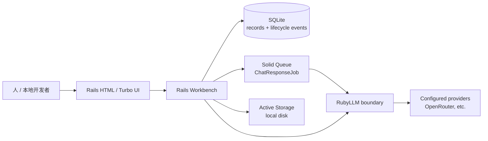
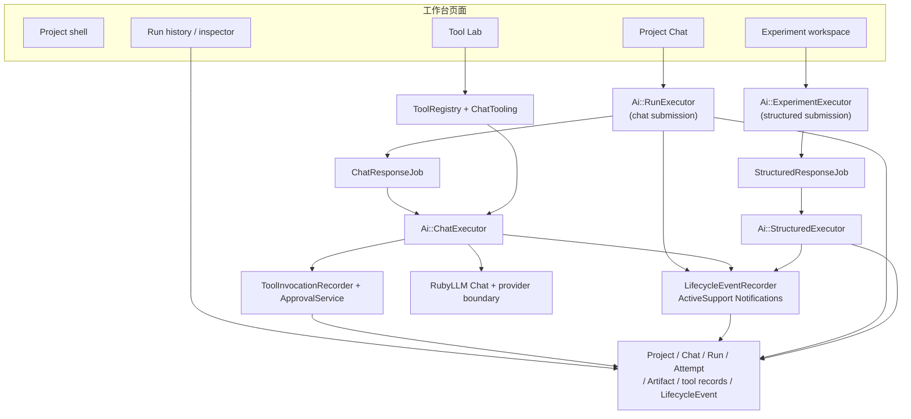
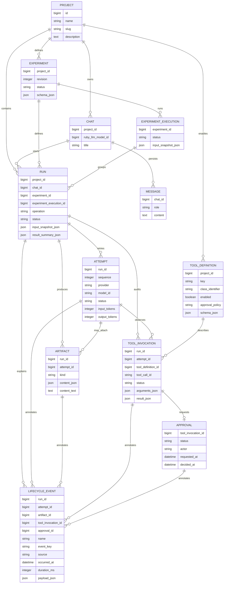
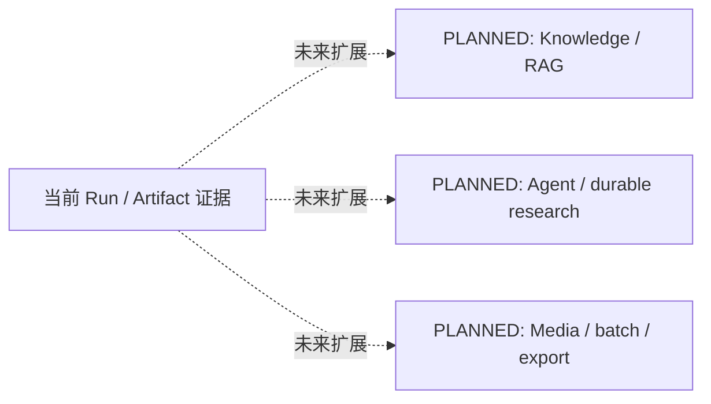
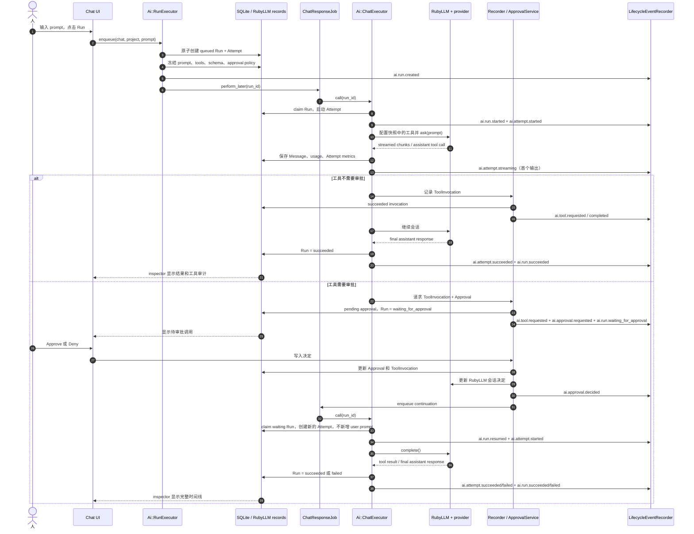
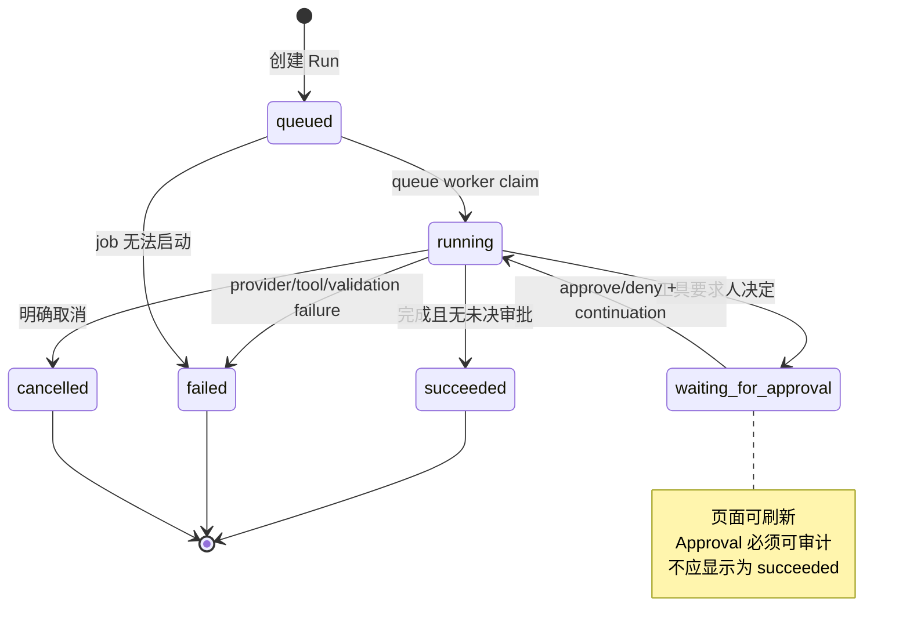
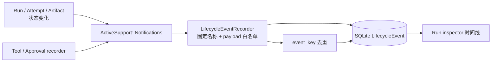
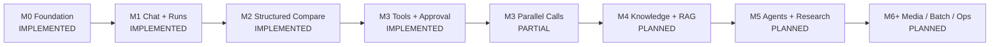

# RubyLLM Workbench 架构与流程图

这些图是项目内部 `docs/` 的当前实现视图，用来帮助人恢复系统关系。它们不是从
数据库自动生成的 ERD，也不是 Specs 的未来架构宣言；具体字段和行为仍以代码、
迁移、测试和运行证据为准。

更新时间：2026-09-16
当前实现：M0–M3 核心闭环和本地 LifecycleEvent 目录 `IMPLEMENTED`
当前图表范围：已验证的本地运行路径；未来节点全部显式标为 `PLANNED`
校准依据：routes、models、migrations、jobs、services、测试，以及 M3 OpenRouter
dogfood（Run #11、Run #13）

## 读图规则

- 先看 L0，得到系统边界；再看 L1，定位代码职责；最后按问题查看数据、时序或状态图。
- `Run` 是一次用户可理解的执行边界；`Attempt` 是其中一次 provider/model 请求。
- `ToolDefinition` 表示“允许什么”，`ToolInvocation` 表示“实际请求了什么”，
  `Approval` 表示“人做了什么决定”。
- `LifecycleEvent` 是按时间索引这些变化的本地元数据记录，不替代原始业务记录，
  也不等同于 provider tracing。
- `PLANNED` 节点不是当前系统已经存在的运行时组件，不能从图中推断出实现。

## 1. L0 — 当前系统上下文

这张图只回答“谁进入系统、系统经过哪条边界、证据落在哪里”。

当前含义：provider 操作从 RubyLLM 边界进入；Run、Message、Attempt、Artifact、工具
调用、审批和 LifecycleEvent 等证据落在本地持久化层；队列负责 Chat continuation。远程部署、账号、
外部数据库和公开访问不属于这张当前实现图。

## 2. L1 — 已实现组件如何连接

这张图缩小了节点数量，只保留人需要定位职责的组件。

代码职责的简化记忆：

1. Controller 只接收页面意图；`Ai::RunExecutor` 或
   `Ai::ExperimentExecutor` 创建带快照的执行边界。
2. Job 把可恢复执行交给 `Ai::ChatExecutor`；结构化流程再由
   `Ai::StructuredExecutor` 负责 schema、validation 和 Artifact。
3. `ToolRegistry`/`ChatTooling` 只允许代码中已注册的工具；Recorder 和
   `ApprovalService` 把调用及人的决定变成可检查记录。
4. provider/conversation 语义仍由 RubyLLM 承担，应用不旁路调用 provider SDK 或 HTTP。

## 3. L2 — 当前持久化关系

这是当前代码中已落地的主要关系；Message 是 RubyLLM 的持久化记录，不能与 Run
混为一谈。

读取关系时记住：

- Experiment 定义可复用的结构化任务；Execution 冻结一次运行；child Run 各自保存
  provider/model 结果，所以一个失败不会被另一个成功覆盖。
- `input_snapshot_json` 是历史证据：之后的工具开关、schema 或模型选择不能回写它。
- Artifact 是可复用的产物，不取代原始 Chat、Run、Attempt 和工具审计。
- LifecycleEvent 只保存允许的 ID、状态、provider/model、时长和错误类别等元数据；
  prompt、工具参数、工具结果和 Artifact 内容仍由原始记录负责。`event_key` 用于
  幂等去重，旧 Run 不做迁移后的合成回填。

### 仍未进入当前关系图的扩展

这些不是缺失的当前表，而是 Specs 和路线图中的后续方向。

## 4. Runtime — 带审批的 Chat Run

这条路径已经用本地 fake provider 测试，并用 OpenRouter Run #13 做过真实 dogfood。
重点是 continuation 使用已有 RubyLLM 会话，不再次追加原始 user prompt。

安全边界：Tool Lab 管理的是 Project-scoped allowlist；浏览器输入不能上传 Ruby，
也不能把任意 shell/code 变成工具。参数和结果展示会过滤明显的 secret 字段。

事件记录是同一条本地执行路径的元数据索引；如果事件持久化失败，主 Run/Attempt
执行不会因此失败，原始业务记录仍是事实来源。

## 5. Runtime — 状态如何推进

Approval 自己的状态是 `pending → approved | denied | expired`。ToolInvocation 更细，
可能经历 `requested → running → succeeded | failed`，也可能在决定后进入 `denied`。
因此不能只看 Run 的最终 badge 判断工具是否真的执行。

## 6. Runtime — LifecycleEvent 目录如何落地

当前应用侧事件名称按五组组织：

- Run：`created`、`started`、`resumed`、`waiting_for_approval`、`succeeded`、`failed`；
- Attempt：`started`、`streaming`、`succeeded`、`failed`；
- Tool：`requested`、`completed`；
- Approval：`requested`、`decided`；
- Artifact：`created`。

事件 payload 只允许关联 ID、状态、provider/model、时长、错误类别和验证结果等
元数据，不复制 prompt、工具参数、工具结果或 Artifact 内容。这个目录已经足够
支持当前 Run inspector 的本地时间线，但不构成 provider-native tracing、分布式
事件总线、成本 dashboard 或历史回填。

## 7. Milestone — 基线与当前实现的距离

`PARTIAL` 的含义是：M3 单个工具调用和审批闭环已验证，但并行调用的 provider
兼容性仍未验收。该状态不能被简化成 M3 全部完成，也不能被误写为 M4/M5 已开始。

## 8. 如何保持图表可信

每次新增或改变以下任一项，都要在同一主题迭代中检查本页：实体/迁移、状态转移、
队列 job、provider 边界、工具审批、Artifact 产出或页面入口。更新时：

1. 先对照 Specs，确认目标和约束没有被误读。
2. 再对照代码、测试和实际页面，把已验证路径写成 `IMPLEMENTED` 或 `PARTIAL`。
3. 尚未落地的目标只写 `PLANNED`；被淘汰的入口写 `DEPRECATED` 或 `REMOVED`，
   不要把未来节点画成当前依赖。
4. 在 [CHANGELOG.md](CHANGELOG.md) 记录变更原因、证据和未证明的边界。

图表是帮助人理解当前系统的压缩视图，不是新的事实来源；当图与代码冲突时，应
先修正图或记录偏差，而不是用图替代代码证据。
