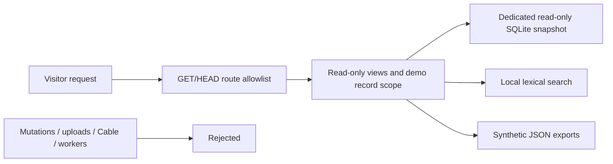

# Read-only synthetic demo

This mode lets visitors inspect the application without executing AI work.
It uses Rails 8.1.4 and RubyLLM 2.1.0. All responses, tokens, costs and timings
are invented examples, not model benchmarks or current provider measurements.
The editable local workbench remains the place to run real workflows.

## Prepare and preview

Install the pinned Ruby/Node dependencies first. From the repository root:

```sh
bin/rails assets:precompile
bin/demo prepare
WORKBENCH_DEMO=1 bin/rails server --binding=127.0.0.1 --port=3000
```

These flags are not secrets. Keep provider keys out of command arguments.
`bin/demo prepare` does not start a server, load private application data or
call providers. It creates one synthetic project with nine Runs, including
a two-model/two-case evaluation comparison. Stop the preview with Ctrl-C.
Never use `bin/dev`, `bin/jobs` or an in-Puma worker for this mode.

Preparation writes `storage/demo/<environment>.sqlite3` and its checksum
manifest from a fresh temporary database. Serving opens that snapshot with
SQLite's read-only option. The normal application/queue databases and uploads
are separate. Rebuild after schema changes; missing or mismatched snapshots
stop boot. Rebuilding replaces only this disposable snapshot, so stop the demo
server before preparation. Prepare and serve with the same `RAILS_ENV`.

For a production candidate, build assets before enabling demo mode, prepare
with `RAILS_ENV=production SECRET_KEY_BASE_DUMMY=1 bin/demo prepare`, and serve
with those same environment flags plus `WORKBENCH_DEMO=1`. The dummy Rails
secret supports this unauthenticated synthetic viewer; it is unsuitable for
an authenticated workbench. Build a dedicated runtime without developer
environment files, keys, credentials, private databases or uploads.
The v0.1 source candidate passed clean Ubuntu setup and production/read-only
container runtime checks; see [verification](CAPABILITIES.md#verification-snapshot).
Public hosting still requires the deployment checks below.

## What visitors can do

Read Chat messages, Agent/tool definitions, Run evidence and source-linked
learning panels. Search the synthetic Knowledge corpus using local lexical
matching. Inspect frozen evaluation inputs, Schema validation and exact
matching. Download synthetic reproduction/event JSON.

The evaluation includes a valid structured paraphrase that fails exact
equality. Transport success, schema validity and answer quality are separate
results. Its invented metrics do not compare actual models.

## Boundaries and verification



The Rack gate runs before body parsing and engine dispatch. New/edit pages,
mutations, Active Storage downloads/direct uploads, Cable and unknown routes
are blocked. Only the synthetic project and its demo Runs can be addressed.
GET synchronization writes are skipped. Final controller parameters force
lexical search and disable reranking, including crafted JSON request bodies.
Demo mode also ignores optional native vector-extension selection.
Provider configuration is cleared without reading provider credentials;
enqueue and immediate ApplicationJob execution are rejected. Database URL
overrides and `SOLID_QUEUE_IN_PUMA` stop boot instead of weakening isolation.

The snapshot manifest detects accidental substitution/staleness; it is not
a signature against someone with write access to the deployment filesystem.
Give the serving process read-only access to the prepared files.

Local tests cover every tour page with SQL write detection, crafted requests,
private record/export isolation, job rejection and actual subprocess boot
against the read-only database. Browser tests cover desktop and 390px usage.
They do not prove an external deployment is configured correctly.

Before hosting, enable TLS and Rails host checks for the chosen hostname,
verify the candidate container/hosted CI, and test the public URL from outside.
The full workbench requires trusted local access or authentication.
See [RELEASING.md](RELEASING.md).
