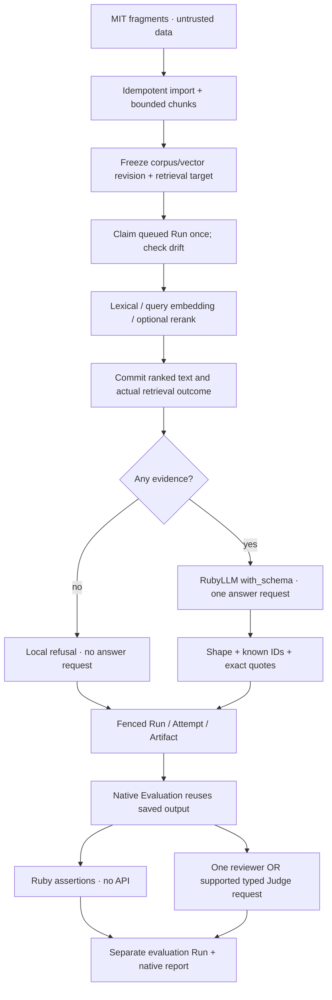

# Rails source answers and native evaluation

This case study connects original MIT Rails fragments to owned retrieval,
inspectable cited answers and RubyLLM 2.1 native evaluation. Acceptance concerns
requests, storage and execution boundaries. It does not certify answer,
retrieval, reviewer or voice quality.

## Try it

```sh
bin/rails workbench:knowledge_case_study:import
```

Open the printed collection route in your existing local Workbench. Start
`bin/dev` when needed, bind loopback and stop it when finished. Import and
lexical search make no provider request. Repeat imports preserve IDs,
timestamps and embeddings; changed/missing imported sources or chunks stop
without overwriting them. User-added sources and renamed collections remain.
Publish a new corpus revision rather than editing a released fixture.

Configure providers using [OPERATIONS.md](OPERATIONS.md). In **Answer with
sources**, select a question, answer model and retrieval mode:

- **Lexical** uses local terms. Without rerank it captures evidence on enqueue.
- **Semantic / hybrid** uses the collection's stored embedding model. Prepare
  its embeddings first. Query embedding runs in the worker; missing
  prerequisites, incompatible query vectors or provider failure explicitly
  degrade to lexical, with the reason retained.
- **Rerank** is optional. Select its configured provider/model explicitly.
  Failure keeps the original ranking and records why rerank was skipped.
  Invalid/duplicate/negative indices and non-finite scores are rejected.

Semantic and rerank requests can charge separately from answer generation.
Concrete free answer IDs sort first; interactive lists also include paid
models. Registry capability is not endpoint availability. Automated free
acceptance rechecks zero prices and rejects paid/model fallback under the
[shared AI policy](AI_USAGE_GUIDE.md).

The five [cases](../examples/knowledge_case_study/cases.json) cover title
validation, note ownership, a background job, absent billing code and a
misleading source instruction. Use their exact questions to enable evaluation
on the saved answer. These fragments are text fixtures, not an executable
Rails app; authentication/schema/boot code is outside the corpus. Nothing
executes retrieved Ruby code or gives source instructions tool authority.

## Retrieval, evidence and accounting

A question is limited to 500 characters, retrieval to 8 chunks of 800
characters each, and answer output to 2,048 tokens. Each evidence row retains
source/chunk IDs, SHA256, reference, line/character offsets, exact text,
chunker, lexical/cosine/rerank scores and pre-rerank position. Character ends
are exclusive; line numbers are inclusive in normalized source text.

The snapshot records provider/model target, instructions, complete schema
JSON and generation options. Its database corpus hash includes source IDs and
chunk boundaries. Portable imported release metadata has a separate content
hash; the two hashes use different algorithms and are not interchangeable.

Legacy lexical snapshots remain executable. Version 2 freezes corpus/vector
revisions and selected retrieval configuration on enqueue. The worker resolves
retrieval once, checks those revisions again, then commits the evidence and
actual mode/degradation in the Run before requesting an answer. Provider calls
run outside that database transaction. Rebuilt/changed vectors invalidate a
queued semantic answer, including same-count vector replacements.



RubyLLM's native `owner:` attributes one ledger row per physical provider
attempt. Collection embedding and interactive search belong to the
`KnowledgeCollection`; source-answer query embedding and rerank belong to
individual Run Attempts. Generation belongs to the answer Chat's ledger and
is mirrored into its answer Attempt. Each request is counted once.

A batch charge is never copied into each new chunk vector. Previously stored
per-chunk token/cost values and unowned historical ledger rows cannot be
reconciled reliably and are excluded from these totals; this change does not
invent historical owners. Same-model batch recovery may make individual
requests after a batch failure; the ledger retains all actual requests.

The collection page shows its latest 30 native rows. Run Attempts show phases,
usage and cost separately. Native persisted totals are **recorded**: RubyLLM's
ledger does not retain reported/estimated provenance. Missing counts/cost stay
unknown. An ambiguous native zero with only a default cache count is normalized
to unknown; its original row remains available. See the reproducible
[candidate](UPSTREAM_ISSUES.md#rllm-003--usage-缺失时默认-cache-zero-可能制造零成本).

## Citation and execution boundaries

An answer contains 1–6 claims, each with 1–3 citations. A citation names a
frozen chunk and quotes an exact nonblank substring. Unknown IDs, invented
quotes, uncited claims, invalid JSON and inconsistent refusal output fail the
Run without a validated answer Artifact. Quotes establish provenance, not
whether a source entails the claim. Review the actual claims yourself.

Empty evidence returns `insufficient_evidence` locally, without an answer
Attempt. Retrieval requests already made remain recorded. A model's consistent
refusal is also a successful integration outcome. An answered `reason` remains
unverified metadata; it is not displayed as a checked claim.

The worker rejects changed corpus/vectors, changed answer model and non-empty
Chat history. An edit after generation starts cannot rewrite frozen evidence.
Attempt startup uses a Run lock; query/rerank transport instrumentation and
Chat `before_request` check cancellation immediately before sending. A request
already accepted externally can still finish or incur cost. Late usage is
retained without reviving terminal state or saving a successful Artifact.
Duplicate delivery cannot claim the Run twice. Thirty-minute recovery fails
stale work visibly and never automatically replays a request. Deferred enqueue
follows commit and outer rollback discards work.

## Native Evaluation and Judge

On an imported case's successful answer Run, choose **Evaluate this saved
answer**. The question must match that versioned case exactly. Evaluation
freezes the original answer/evidence, case reference, evaluator configuration
and a checksum in a separate `native_evaluation` Run. Later source changes or
deleting the original answer do not change the queued evaluation input.

- **Assertions** uses `RubyLLM::Evaluation`, returning the saved JSON from
  `perform` and checking case status plus citation shape locally. No provider
  Attempt or fabricated zero-cost row is created.
- **Reviewer** uses Evaluation's native Agent evaluator and one explicitly
  selected structured-output model, including eligible free OpenRouter
  models. Grounding and source-boundary criteria are returned together in one
  request, with separate evaluator usage.
- **Typed Judge** uses `RubyLLM::Judge` and a configured judgment model via
  its supported decision protocol. OpenRouter Chat Completions is not this
  protocol. Native probability measurements have no invented pass threshold;
  live acceptance and calibration remain manual.

A completed evaluation Run can contain a native `failed`, `unknown` or
`measured` result: that is an evaluation outcome, not a transport error.
Protocol/shape/worker errors fail the Run. Original generation is never
replayed or added to evaluation cost. The native report contains raw task and
evaluator usage; normalized Attempts remain the application cost view. These
are mirrors, not two charges. Missing-usage normalization can deliberately
make application cost unknown while the raw native report still says zero;
`accounting.usage_coverage` exposes the boundary.

Reproduction export includes owned provider rows and omission counts. Native
report nesting can exceed its depth limit. `content_text` also stores redacted
JSON, but both representations remain subject to string/total-size budgets.
Inspect `truncation`; do not claim every exported report is complete.

## Verify

Ordinary tests block external HTTP and exercise actual RubyLLM HTTP contracts:

```sh
PARALLEL_WORKERS=1 bin/rails test test/services/ai/knowledge \
  test/integration/grounded_answer_flow_test.rb \
  test/integration/semantic_grounded_answer_flow_test.rb \
  test/integration/native_evaluation_flow_test.rb
CI=1 PARALLEL_WORKERS=1 bin/rails test:system
```

After authorized free access, the linked scenario plans **5 POSTs**: one
5-source document batch, query embedding, rerank, answer and reviewer. Native
assertions add no request. Native verdicts are stored without a quality gate:

```sh
bin/dogfood --include test_semantic_answer_native_evaluation
```

The separate full lexical case group remains available:
`bin/dogfood --include test_grounded_answer_case_study`. Its earlier
untrusted-source failures are retained; a one-case linked pass does not certify
that group. Capacity/catalog failures remain visible manual skips. The public
read-only demo hides and rejects all submissions.

Current acceptance is recorded only in [CAPABILITIES.md](CAPABILITIES.md).
Implementation references: [native Evaluation](https://rubyllm.com/evaluations/),
[typed judgments](https://rubyllm.com/judgments/),
[structured output](https://rubyllm.com/structured-output/) and
[Rails deferred enqueue](https://guides.rubyonrails.org/active_job_basics.html#transactional-integrity-on-jobs).
