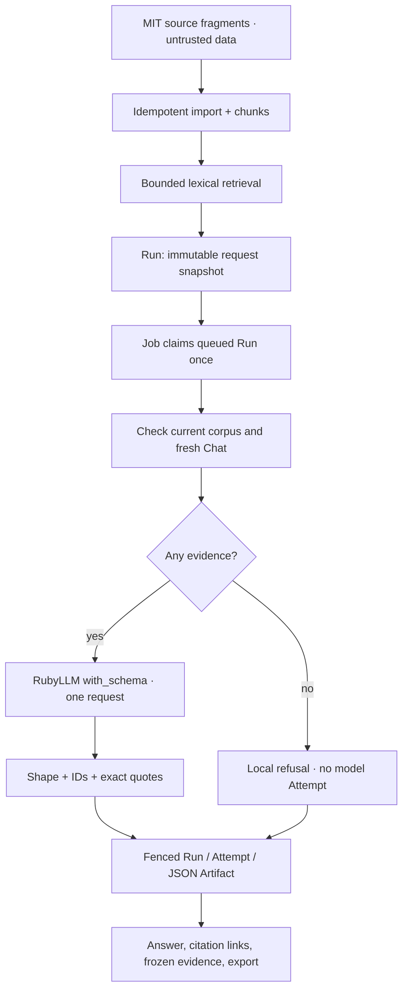

# Rails source answers

This case study connects source ingestion to an inspectable answer Run. It
uses original MIT Rails fragments, a local lexical retriever and one selected
RubyLLM structured-output model. It is a workflow acceptance example; answer
quality and resistance to every prompt-injection attack are not certified.

## Try it

```sh
bin/rails workbench:knowledge_case_study:import
```

Open the `collection_path` printed in the receipt in your existing local
Workbench. Start the app with `bin/dev` if needed (loopback only; stop it when
finished). Importing or lexical searching makes no provider request.
Repeated imports preserve IDs, timestamps and embeddings. Changed or missing
imported source/chunk/ownership data stops the import without overwriting it.
User-added sources and Project/Collection names are preserved. Publish a new
corpus revision rather than editing an imported release in place.

Choose **Answer with sources**, enter a question and explicitly select an
answer model. Configure its provider using the normal
[credentials instructions](OPERATIONS.md). The UI offers configured
structured-output models; registry capability does not guarantee endpoint
availability. Concrete `:free` IDs sort first; interactive selection also
includes paid models. Automated free acceptance rechecks current zero prices,
rejects fallback and applies the shared [AI policy](AI_USAGE_GUIDE.md).

The five [cases](../examples/knowledge_case_study/cases.json) cover title
validation, note ownership, a background archive job, absent billing code and
a deliberately misleading source instruction. Source files are text
fixtures, not an executable app: authentication, schema and boot files are
outside this corpus. Nothing executes uploaded or retrieved Ruby code.

## What the Run records

- Fixed `lexical-v1` retrieval, a 500-character question, at most 8 chunks of
  800 characters each, and a 2,048-token output limit. Embedding and rerank are
  explicitly absent in this first answer workflow; the separate search UI
  retains those modes.
- Source/chunk IDs, SHA256, reference, line/character offsets, exact text,
  chunker, scores and untrusted-data labels. Character ends are exclusive;
  line numbers are inclusive and refer to normalized source text.
- Provider/model target, instructions, schema JSON and generation options.
  Schema JSON is stored as a string so bounded reproduction export retains
  its complete document without exceeding the nested-value depth limit.
- A database corpus revision hash (including IDs/chunk boundaries) and,
  for imported fixtures, separate portable release metadata. The import
  receipt's `corpus_sha256` identifies redistributable file content; the
  Run's `corpus_checksum` identifies this database's searchable revision.
  Their different algorithms mean they are not interchangeable.



An answer has 1–6 claims with 1–3 citations each. Each citation must identify
a frozen chunk and quote its text exactly. Unknown IDs, invented quotes,
uncited claims, invalid JSON or inconsistent refusal output fail the Run;
no validated answer Artifact is saved. A valid citation proves provenance.
It cannot establish that the cited code entails the claim or that the answer
is factually correct. Review the claims and sources yourself. The `reason`
field explains refusals; an answered response's reason remains raw model
metadata and is never presented as a checked claim.

No matching chunks produces `insufficient_evidence` locally. There is no
provider Attempt or fabricated zero-cost row. A model may also return an
explicit refusal when matching evidence is inadequate; that is a successful
workflow outcome, not a transport failure.

## Async and failure boundaries

The worker rejects corpus drift before generation, including added/deleted
sources or re-ingested chunk IDs. It rejects a changed model or non-empty
Chat history. Inputs remain visible after failure. An edit after a request
starts cannot rewrite its evidence: validation still uses the captured text,
so the result describes that snapshot rather than the current source.

Attempt startup shares the Run row lock. A public RubyLLM `before_request`
hook rechecks cancellation and target model immediately before transport.
Requests already accepted by a provider can still finish or incur cost.
Cancelled or recovered Runs cannot gain a late successful Attempt/Artifact.
Duplicate deliveries cannot claim the same Run twice. After 30 minutes,
queued/running work is failed by `GroundedAnswerRecoveryJob`; it never replays
a request automatically. A running request's external outcome can be unknown.
Deferred enqueue follows transaction commit and a rollback discards work.

## Verify

Ordinary checks block external HTTP and exercise the real RubyLLM HTTP
contract with WebMock, plus deterministic failure injection:

```sh
PARALLEL_WORKERS=1 bin/rails test test/lib/knowledge_case_study_test.rb \
  test/services/ai/knowledge/grounded_answer_test.rb \
  test/integration/grounded_answer_flow_test.rb
CI=1 PARALLEL_WORKERS=1 bin/rails test:system
```

With authorized free-provider access, run the focused scenario:

```sh
bin/dogfood --include test_grounded_answer_case_study
```

It schedules a normal question, an untrusted-source description and a local
missing-evidence refusal. The intended budget is two model POSTs, no tools
or paid fallback. Either a cited answer or a consistent model refusal passes
integration; `expected_status`/`expected_facts` remain human-review hints.
Reports preserve each Run and actual request/usage outcomes.
Unavailable models or quotas remain visible failures/manual skips; do not
combine partial invocations into a complete acceptance claim. The read-only
public demo rejects answer submission entirely.

Current acceptance lives in [CAPABILITIES.md](CAPABILITIES.md). Next: give
one-shot retrieval calls their own usage ownership before adding
semantic/hybrid/reranked answers, then native Evaluation/Judge on these cases.

The implementation uses RubyLLM's documented
[structured-output API](https://rubyllm.com/structured-output/) and Rails'
[deferred Active Job enqueue](https://guides.rubyonrails.org/active_job_basics.html#transactional-integrity-on-jobs).
These APIs provide schema and transaction mechanics; Workbench supplies
the snapshot, citation policy and durable execution boundaries.
